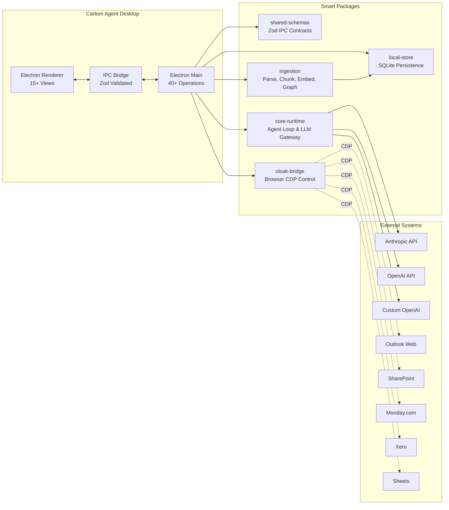

# 1. System Overview

## What is Carbon Agent?

Carbon Agent is an **Electron-based desktop application** for enterprise document reasoning with authenticated browser sessions. It enables users to:

- Connect to multiple AI providers (Anthropic, OpenAI, custom OpenAI-compatible)
- Authenticate browser sessions for enterprise tools (Outlook, SharePoint, Monday, Xero)
- Ingest documents from multiple sources
- Run autonomous multi-agent orchestration for data collection
- Generate outputs (Markdown, DOCX, PDF)
- Learn reusable skills from successful workflows

## Value Proposition

| Pain Point | Carbon Agent Solution |
|------------|----------------------|
| Manual data gathering across tools | Autonomous browser collection with persistent sessions |
| API integrations not available | Browser-native data access via CDP |
| Fragmented document workflows | Unified ingestion, storage, and generation pipeline |
| No auditable trail | Event-sourced agent runs with full provenance |
| Expensive cloud SaaS | Local-first, runs on user's machine |

## Architecture at a Glance

## Key Specifications

| Spec | Value |
|------|-------|
| **Platform** | Electron 33+ |
| **Node Version** | >= 22.0.0 |
| **Package Manager** | pnpm (monorepo) |
| **Renderer** | Vanilla TypeScript (no React/Vue/Svelte) |
| **Styling** | CSS Variables, custom design system |
| **IPC Validation** | Zod schemas for all requests/responses |
| **Database** | SQLite (better-sqlite3) |
| **Embedder** | Xenova Transformers (local) |
| **Window Size** | 1400 × 900 px |
| **Current Version** | 0.1.0 |
