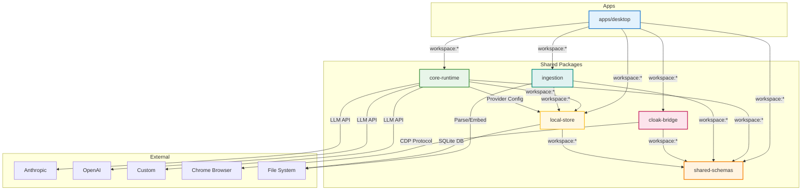
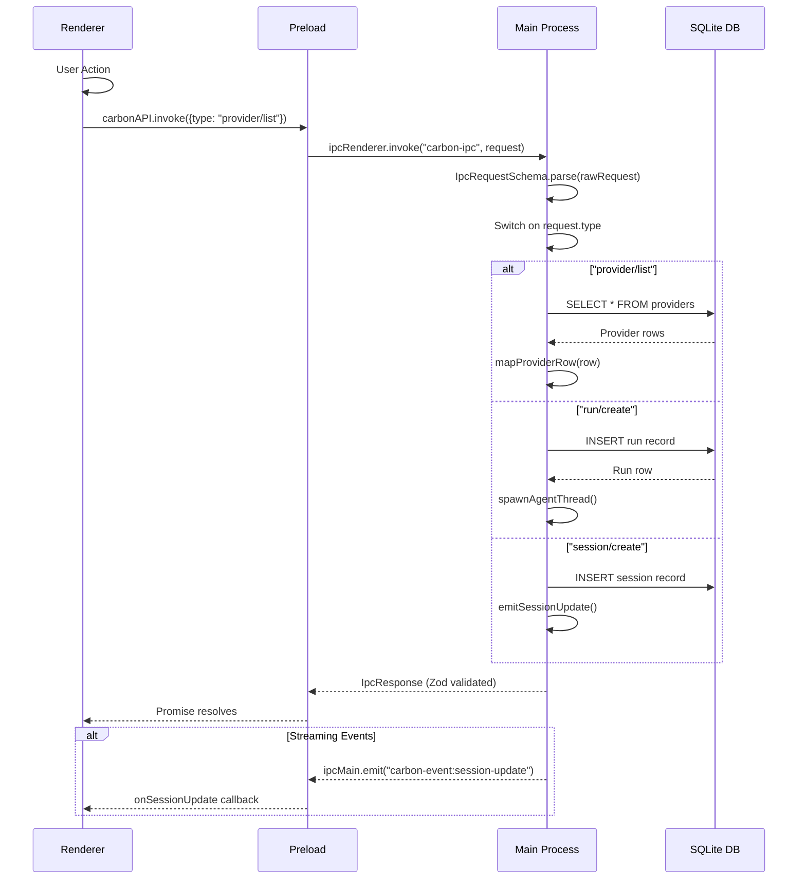
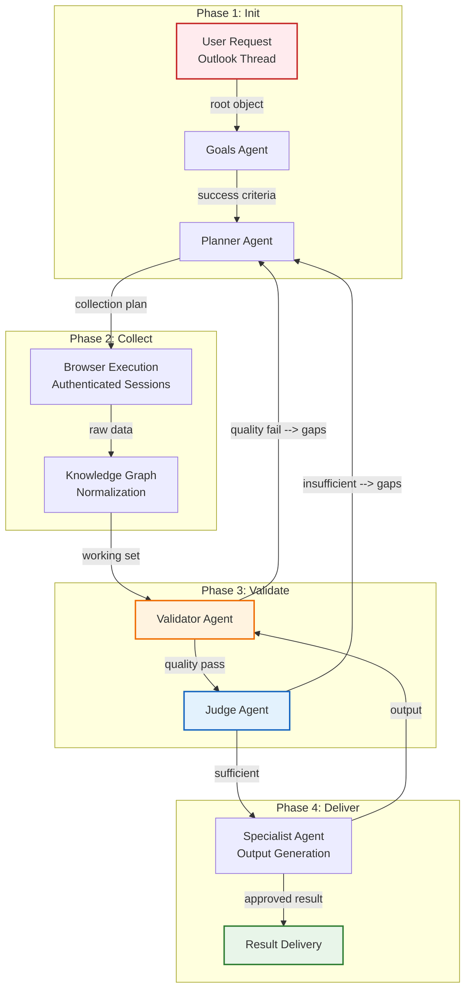
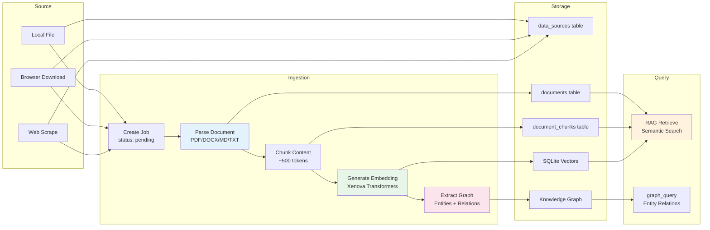
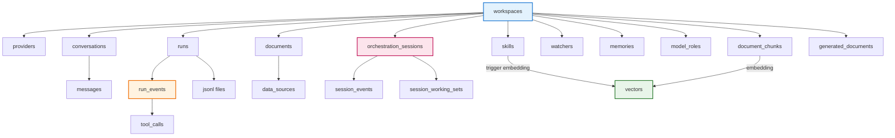

# 2. Architecture & Data Flow

## 2.1 Monorepo Architecture



## 2.2 IPC Communication Architecture

The IPC layer enforces type safety through Zod schemas. All communication is strictly validated.

### 2.2.1 Request Flow (Renderer → Main)



### 2.2.2 Event Flow (Main → Renderer)

| Event Channel | Payload | Emitted When |
|--------------|---------|-------------|
| `carbon-event:viewport-frame` | `{profileId, screenshot}` | Browser viewport capture |
| `carbon-event:agent-topology` | `{runId, nodes, edges}` | Agent topology changes |
| `carbon-event:axtree` | `{profileId, tree, activeNodeId}` | Accessibility tree update |
| `carbon-event:watcher-analytics` | `{runs[]}` | Watcher run completes |
| `carbon-event:vault-change` | `{workspaceId, filePath, content}` | Vault file modified |
| `carbon-event:session-update` | `{sessionId, status, currentGoal}` | Orchestration session state |
| `carbon-event:session-working-set` | `{documents[], gaps[], provenanceScore}` | Working set update |
| `carbon-event:session-event` | `{sessionId, event}` | New session event logged |

## 2.3 Agent Execution Flow

### 2.3.1 Single Run Flow

```mermaid
graph TD
    A[User sends message<br/>in Playground] --> B[createRun()<br/>SQLite]
    B --> C[runAgent(runId)<br/>agent-runner.ts]
    C --> D[Load conversation history]
    D --> E[Build LLM prompt]
    E --> F[Stream request to LLM]
    F -->|chunk| G[Append to JSONL log]
    G --> H[Emit stream events]
    H --> I[Update UI in real-time]
    F --> J[Tool call detected?]
    J -->|Yes| K[Execute tool]
    K --> L[Store tool output]
    L --> E
    J -->|No| M[Complete response]
    M --> N[Update run status]
    N --> O[Emit completion event]

    style A fill:#e3f2fd
    style F fill:#fff3e0
    style K fill:#fce4ec
    style M fill:#e8f5e9
```

### 2.3.2 Orchestration Session Flow



## 2.4 Document Processing Pipeline



## 2.5 Database Primary Tables


