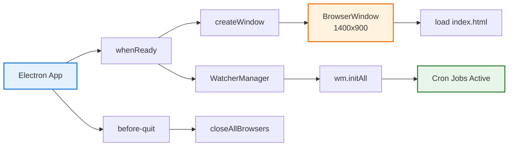
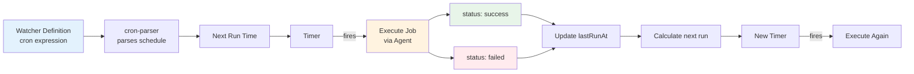
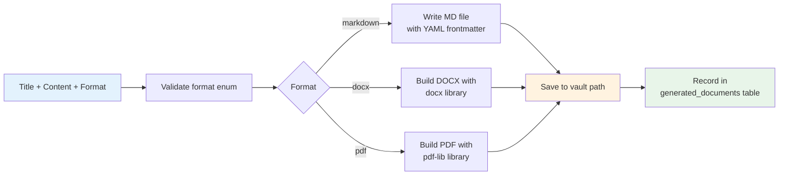
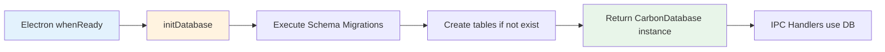
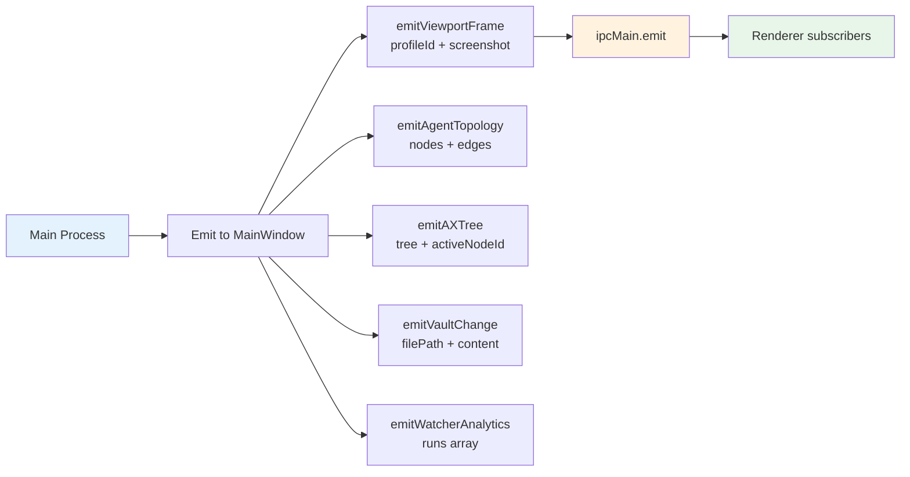

# 3. Desktop Application (Electron)

## 3.1 Main Process

### Entry Point: `apps/desktop/src/main.ts`



### Window Configuration

```typescript
new BrowserWindow({
  width: 1400,
  height: 900,
  webPreferences: {
    preload: path.join(__dirname, "preload.js"),
    contextIsolation: true,   // Security: renderer cannot access Node.js
    nodeIntegration: false,   // Security: no require() in renderer
    sandbox: true             // Security: OS-level sandbox
  }
});
```

### Security Model

| Feature | Status | Reason |
|---------|--------|--------|
| contextIsolation | ✅ Enabled | Separate renderer from Node.js context |
| nodeIntegration | ❌ Disabled | Prevents require() in renderer |
| sandbox | ✅ Enabled | OS-level process isolation |
| contextBridge | ✅ Used | Only whitelisted APIs exposed |
| IPC Validation | ✅ Zod | All messages validated at boundary |

## 3.2 Preload Script

### File: `apps/desktop/src/preload.ts`

```mermaid
graph LR
    subgraph "Renderer Context" 
        R[window.carbonAPI]
    end
    subgraph "Preload Bridge"
        P[contextBridge
        exposeInMainWorld]
    end
    
    subgraph "Main Process"
        M[ipcMain.handle]
    end

    R -->|invoke()| P
    P -->|ipcRenderer.invoke| M
    M -->|ipcMain.emit| P
    P -->|on(channel)| R

    style R fill:#e3f2fd
    style M fill:#fff3e0
```

### Exposed API Structure

```typescript
// All operations go through single IPC channel "carbon-ipc"
interface CarbonAPI {
  // One-shot requests
  invoke: (request: IpcRequest) => Promise<IpcResponse>;
  
  // Subscriptions (return unsubscribe function)
  onViewportFrame:     (cb) => () => void;  // Screenshot from browser
  onAgentTopology:     (cb) => () => void;  // Agent execution graph
  onAXTree:            (cb) => () => void;  // Accessibility tree
  onWatcherAnalytics:  (cb) => () => void;  // Run statistics
  onVaultChange:       (cb) => () => void;  // File modified
  onSessionUpdate:     (cb) => () => void;  // Orchestration state
  onSessionWorkingSet: (cb) => () => void;  // Data updates
  onSessionEvent:        (cb) => () => void;  // New events
}
```

## 3.3 IPC Handlers

### File: `apps/desktop/src/ipc-handlers.ts` (719 lines)

**Single consolidated handler** for all IPC operations (replaces broken multi-file approach).

### Handler Operations by Category

```mermaid
graph TB
    H[IPC Handler<br/>"carbon-ipc"] --> P[Provider<br/>5 ops]
    H --> PR[Profile<br/>8 ops]
    H --> W[Workspace<br/>3 ops]
    H --> C[Conversation<br/>4 ops]
    H --> R[Run<br/>5 ops]
    H --> O[Orchestration<br/>5 ops]
    H --> I[Ingestion<br/>2 ops]
    H --> WA[Watcher<br/>6 ops]
    H --> D[Document Gen<br/>1 ops]
    H --> V[Vault<br/>3 ops]
    H --> S[Skills<br/>4 ops]
    H --> M[Memory<br/>2 ops]
    H --> MR[Model Roles<br/>3 ops]
    H --> CLI[CLI<br/>1 op]
    H --> ST[Stats<br/>1 op]

    style H fill:#e3f2fd,stroke:#1976d2,stroke-width:2px
    style P fill:#fff3e0
    style PR fill:#fce4ec
    style O fill:#e8f5e9
    style WA fill:#e0f2f1
    style ST fill:#f3e5f5
```

### Operation Matrix

| Category | Operations | Description |
|----------|------------|-------------|
| **Provider** | list, create, update, delete, test | AI provider CRUD |
| **Profile** | list, create, update, delete, health, launchLogin, lock, unlock | Browser profiles |
| **Workspace** | list, create, get | Workspace management |
| **Conversation** | list, create, get, delete | Chat threads |
| **Run** | list, create, get, cancel, stream | Agent executions |
| **Orchestration** | session/create, start, get, events, working-set | Multi-agent sessions |
| **Ingestion** | scan, retry | Document processing |
| **Watcher** | list, create, update, toggle, delete, run | Scheduled tasks |
| **Document** | generate | DOCX/PDF/Markdown |
| **Vault** | list, read, write | Note management |
| **Skills** | list, pin, delete, export, import | Reusable skills |
| **Memory** | list, delete | Agent memory |
| **Model Roles** | list, set, delete | Role-to-provider mapping |
| **CLI** | detect | Claude Code / Codex detection |
| **Stats** | list | Active runs count |

## 3.4 Agent Runner

### File: `apps/desktop/src/agent-runner.ts`

**Purpose**: Execute a single agent run with message streaming and tool execution.

```mermaid
graph LR
    A[runAgent(runId, message)] --> B[Load Conversation
    from SQLite]
    B --> C[Create JSONL Log
    file]
    C --> D[Build Prompt
    messages + context]
    D --> E[Stream to LLM
    via core-runtime]
    E -->|chunk| F[Append to
    JSONL log]
    F --> G[Emit event
    to renderer]
    E --> H[Detect Tool Call]
    H -->|stealth_open| I[Browser
    Navigate]
    H -->|stealth_scrape| J[Extract
    Content]
    H -->|stealth_download| K[Download
    File]
    H -->|ingest_file| L[Process
    Document]
    H -->|rag_retrieve| M[Search
    Knowledge]
    H -->|write_note| N[Write to
    Vault]
    I --> O[Store Result]
    O --> P[Add to
    messages]
    P --> E
    H -->|No tool| Q[Complete
    response]
    Q --> R[Update run
    as completed]

    style A fill:#e3f2fd
    style E fill:#fff3e0
    style H fill:#fce4ec
    style Q fill:#e8f5e9
```

## 3.5 Watcher Manager

### File: `apps/desktop/src/watcher-manager.ts`

**Purpose**: Execute scheduled cron-based watcher tasks.



### Watcher Lifecycle

| Field | Type | Description |
|-------|------|-------------|
| `id` | UUID | Unique identifier |
| `workspaceId` | UUID | Associated workspace |
| `name` | string | Human-readable name |
| `prompt` | string | Task instruction for agent |
| `cronExpression` | string | Schedule (e.g., "0 9 * * 1") |
| `enabled` | boolean | Active flag |
| `profileId` | UUID | Browser profile for auth |
| `lastRunAt` | timestamp | Last execution time |
| `lastRunStatus` | enum | success, failed, running, pending |
| `createdAt` | timestamp | Creation time |
| `updatedAt` | timestamp | Last modification |

## 3.6 Document Generator

### File: `apps/desktop/src/document-generator.ts`

**Purpose**: Generate documents in multiple formats from content.

| Input | Output | Library |
|-------|--------|---------|
| Markdown string | `.md` file | Native |
| Content + metadata | `.docx` file | `docx` npm |
| Content + layout | `.pdf` file | `pdf-lib` npm |



## 3.7 Database Context

### File: `apps/desktop/src/db-context.ts`

**Purpose**: Manage database initialization and connections.



## 3.8 Desktop Events

### File: `apps/desktop/src/desktop-events.ts`

**Purpose**: Emit live events from Main to Renderer.



## 3.9 Session Events

### File: `apps/desktop/src/session-events.ts`

**Purpose**: Orchestration session update emitters.

| Emitter | Triggered |
|---------|-----------|
| `emitSessionUpdate` | Session status changes (draft → running → completed) |
| `emitSessionWorkingSet` | Working set documents or provenance updates |
| `emitSessionEvent` | New structured event appended to session log |
