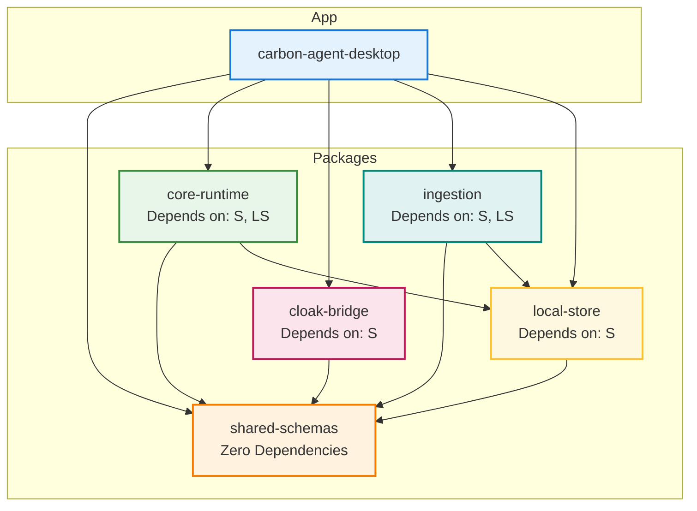
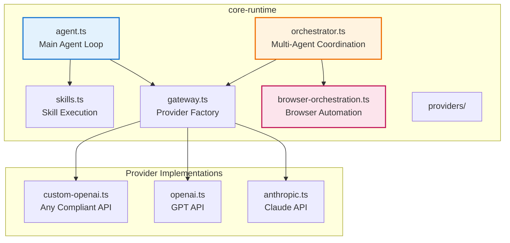
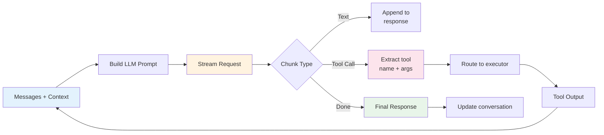
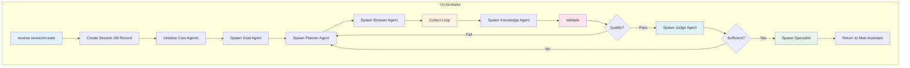
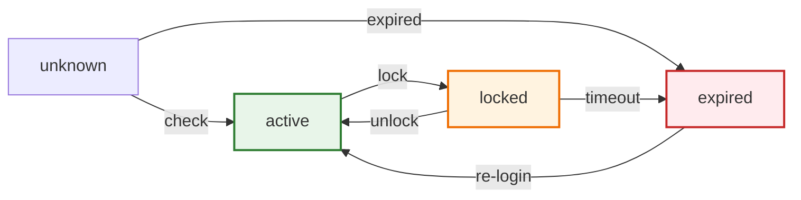
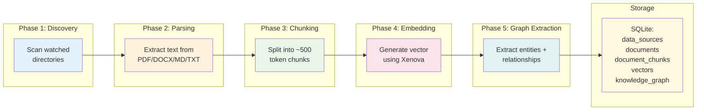
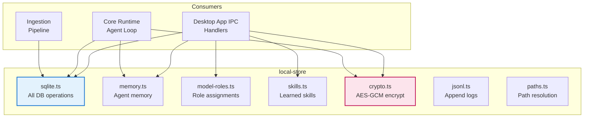
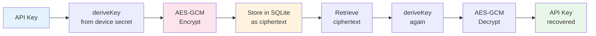

# 4. Package Reference

## 4.1 Package Dependency Graph



## 4.2 Shared Schemas (`@carbon-agent/shared-schemas`)

**Location**: `packages/shared-schemas/src/index.ts`  
**Size**: 709 lines | 27.8 KB  
**Purpose**: Zod schemas for all domain types and IPC contracts

### Schema Classes

```mermaid
graph LR
    subgraph "AI Provider Models"
        P1[AIProviderConfigSchema<br/>id, type, name, apiKey, baseUrl, model]
        P2[AIProviderPublicSchema<br/>Same but no apiKey]
    end

    subgraph "Browser Models"
        B1[BrowserProfileSchema<br/>id, name, targetDomains, status, cdpUrl, profileDir]
        B2[SupervisionModeSchema<br/>watch | confirm]
    end

    subgraph "Workspace Models"
        W1[WorkspaceSchema<br/>id, name, vaultDir]
        W2[ConversationSchema<br/>id, workspaceId, messages]
        W3[RunSchema<br/>id, conversationId, status, messages, jsonlLogPath]
        W4[RunEventSchema<br/>id, runId, type, timestamp, payload]
    end

    subgraph "Skill Models"
        S1[LearnedSkillSchema<br/>trigger, toolSequence, successCount, failureCount, version]
        S2[ToolCallSchema<br/>stealth_open, scrape, download, ingest_file, rag_retrieve, write_note]
    end

    subgraph "Orchestration Models"
        O1[OrchestrationSessionSchema<br/>workspaceId, conversationId, root, supervisionMode, currentGoal]
        O2[SessionEventSchema<br/>sessionId, role, kind, summary, payload]
        O3[SessionWorkingSetSchema<br/>documents, gaps, provenanceScore, metrics]
        O4[CoreAgentRoleSchema<br/>main-assistant, goals, planner, browser, knowledge, validator, judge]
    end

    style P1 fill:#e3f2fd
    style B1 fill:#fce4ec
    style W1 fill:#fff3e0
    style S1 fill:#e8f5e9
    style O1 fill:#e0f2f1
```

### CoreAgentRoleSchema Detail

| Role | Responsibility | Model Type |
|------|-------------|------------|
| `main-assistant` | User conversation, specialist spawning | Fast |
| `goals` | Define success criteria | Reasoning |
| `planner` | Collection strategy | Reasoning |
| `browser` | Authenticated browser ops | Fast |
| `knowledge` | Working set normalization | Reasoning |
| `validator` | Quality gate | Reasoning |
| `judge` | Sufficiency decision | Reasoning |

### SessionEventKindSchema Values

| Event | When Emitted |
|-------|-------------|
| `goal_defined` | Goals agent sets objective |
| `plan_updated` | Planner refines strategy |
| `browser_action_started` | Browser agent begins navigation |
| `browser_action_completed` | Browser agent finishes extraction |
| `document_discovered` | New source found |
| `document_acquired` | Document downloaded/parsed |
| `working_set_updated` | Knowledge graph updated |
| `validation_passed` | Validator approves quality |
| `validation_failed` | Validator rejects, sends to planner |
| `judgment_requested` | Judge evaluates sufficiency |
| `judgment_returned` | Judge approves or requests more |
| `specialist_spawned` | New specialist agent created |
| `specialist_completed` | Specialist returns results |
| `output_approved` | Final output passes all gates |
| `output_rejected` | Output needs revision |

## 4.3 Core Runtime (`@carbon-agent/core-runtime`)

**Location**: `packages/core-runtime/src/`  
**Purpose**: Agent execution engine, LLM provider routing, orchestration

### Module Breakdown



### Agent Loop (agent.ts)



### LLM Gateway (gateway.ts)

| Provider | Pattern | Default Model |
|----------|---------|---------------|
| Anthropic | Claude API | Claude Sonnet |
| OpenAI | GPT API | GPT-4 |
| Custom OpenAI | Base URL + API Key | User-specified |

### Orchestrator (orchestrator.ts)



### Browser Orchestration (browser-orchestration.ts)

| Method | Description |
|--------|-------------|
| `startViewportStreaming(profileId)` | Capture browser screenshots |
| `stopViewportStreaming(profileId)` | End screenshot capture |
| `getAccessibilityTree(profileId)` | Extract page AX tree |
| `executeBrowserAction(profileId, action)` | Run stealth action |
| `observePageChanges(profileId)` | Monitor DOM mutations |

### Skills (skills.ts)

| Method | Description |
|--------|-------------|
| `registerSkill(skill)` | Add learned skill to registry |
| `executeSkill(trigger, context)` | Match trigger, execute tool sequence |
| `recordSkillSuccess(skillId)` | Increment success count |
| `recordSkillFailure(skillId)` | Increment failure count, check disable |

## 4.4 Cloak Bridge (`@carbon-agent/cloak-bridge`)

**Location**: `packages/cloak-bridge/src/index.ts`  
**Purpose**: Chrome DevTools Protocol (CDP) session management

```mermaid
graph LR
    C[Chrome Browser] --> CDP[CDP WebSocket
    localhost:9222]
    CDP --> CB[CloakBridge]
    CB --> B1[launchBrowser(profile)]
    CB --> B2[connectCDP(url)]
    CB --> B3[stealthNavigate(tab, url)]
    CB --> B4[stealthScrape(tab)]
    CB --> B5[stealthDownload(tab, url)]
    CB --> B6[checkSessionHealth(profileId)]
    CB --> B7[launchLoginPortal(profileId)]
    CB --> B8[closeAllBrowsers()]

    style C fill:#e3f2fd,stroke:#1976d2,stroke-width:2px
    style CDP fill:#fff3e0,stroke:#ef6c00,stroke-width:2px
    style CB fill:#fce4ec,stroke:#c2185b,stroke-width:2px
```

### Browser Profile States



## 4.5 Ingestion (`@carbon-agent/ingestion`)

**Location**: `packages/ingestion/src/`  
**Purpose**: Document processing pipeline

### Pipeline Phases



### Module Details

| Module | Function |
|--------|----------|
| `index.ts` | Orchestrate full pipeline, export APIs |
| `graph.ts` | Build knowledge graph from entity extraction |
| `semantic-embed.ts` | Generate embeddings with Xenova transformers |

## 4.6 Local Store (`@carbon-agent/local-store`)

**Location**: `packages/local-store/src/`  
**Purpose**: Data persistence, encryption, file management

### Module Details



### SQLite Schema Modules

| Module | Tables Managed |
|--------|---------------|
| `sqlite.ts` | All tables (providers, workspaces, conversations, runs, documents, etc.) |
| `memory.ts` | memories table (key-value with tags, importance) |
| `skills.ts` | skills table (tool sequences, success metrics) |
| `model-roles.ts` | model_roles table (role → provider mapping) |

### Encryption (crypto.ts)



### JSONL Logging (jsonl.ts)

| Feature | Description |
|---------|-------------|
| Format | Append-only JSON Lines |
| Structure | `{id, runId, type, timestamp, payload}` |
| Use Case | Complete audit trail for every agent run |
| Location | `~/.carbon-agent/logs/{runId}.jsonl` |

### Path Resolution (paths.ts)

| Path | Purpose |
|------|---------|
| `~/.carbon-agent/db.sqlite` | Main database |
| `~/.carbon-agent/vault/{workspaceId}/` | Knowledge vault files |
| `~/.carbon-agent/logs/` | Run event logs |
| `~/.carbon-agent/profiles/` | Cloak browser profiles |
