# 5. User Interface

## 5.1 Application Layout Diagram

```mermaid
graph TB
    subgraph "Carbon Agent Desktop"
        direction TB
        
        subgraph "Top Bar"
            TB[48px height
            Workspace Label / Provider Label / Status]
        end
        
        subgraph "Sidebar [200px]"
            SH[Sidebar Header<br/>Logo + "Carbon"]
            NG1[Nav Group: Core]
            ND1[--- divider ---]
            NG2[Nav Group: Data]
            ND2[--- divider ---]
            NG3[Nav Group: Config]
            ND3[--- divider ---]
            NG4[Nav Group: Cognitive]
            ND4[--- divider ---]
            NG5[Nav Group: Debug]
            SF[Sidebar Footer<br/>v0.1.0 badge + status dot]
        end
        
        subgraph "Main Content Area"
            PT[Page Title Bar<br/>h1: Current View]
            CS[Content Shell<br/>flex: 1]
        end
        
        subgraph "Right Panel"
            INS[Inspector Panel<br/>380px, slide-in]
        end
        
        subgraph "Floating Overlays"
            CMDK[Command Palette<br/>Ctrl+K modal]
            LV[Live Viewport<br/>Browser preview]
            RI[Run Inspector<br/>Modal popup]
            TC[Toast Container<br/>Auto-dismiss notifications]
        end
    end
    
    TB <-->|context| SH
    NG1 --> CS
    PT --> CS
    CS --> INS
    CS -.-> CMDK
    CS -.-> LV
    CS -.-> RI
    CS -.-> TC

    style SH fill:#e3f2fd,stroke:#1976d2,stroke-width:2px
    style TB fill:#fff3e0,stroke:#ef6c00,stroke-width:2px
    style CS fill:#e8f5e9,stroke:#388e3c,stroke-width:2px
    style INS fill:#fce4ec,stroke:#c2185b,stroke-width:2px
    style CMDK fill:#f3e5f5,stroke:#7b1fa2,stroke-width:2px
    style NG1 fill:#e0f2f1
    style NG2 fill:#fff8e1
    style NG3 fill:#e3f2fd
    style NG4 fill:#fce4ec
    style NG5 fill:#f3e5f5
```

## 5.2 Navigation Structure

### Sidebar Groups (5 Groups, 15+ Views)

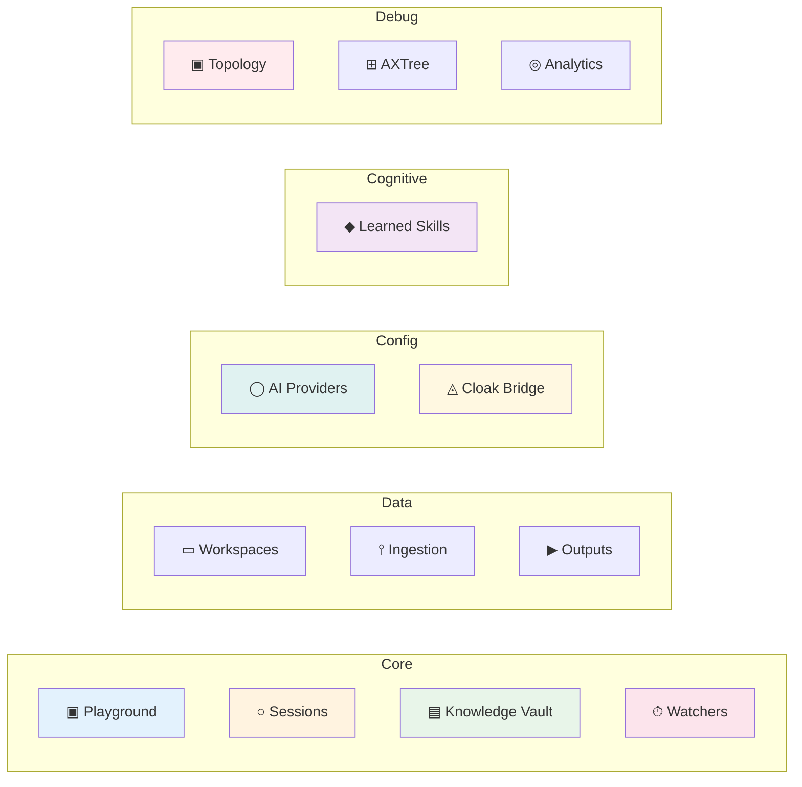

### View Details

| # | View | File | Category | Purpose |
|---|------|------|----------|---------|
| 1 | **Playground** | `views/playground-view.ts` | Core | Chat interface with AI |
| 2 | **Sessions** | `views/session-view.ts` | Core | Orchestration session control |
| 3 | **Knowledge Vault** | `vault.ts` | Core | Note-taking with backlinks |
| 4 | **Watchers** | `views/watchers-view.ts` | Core | Scheduled task monitoring |
| 5 | **Workspaces** | `views/workspaces-view.ts` | Data | Manage isolation boundaries |
| 6 | **Ingestion** | `views/ingestion-view.ts` | Data | Document pipeline status |
| 7 | **Outputs** | `views/outputs-view.ts` | Data | Generated document viewer |
| 8 | **AI Providers** | `views/providers-view.ts` | Config | LLM provider settings |
| 9 | **Cloak Bridge** | `views/profiles-view.ts` | Config | Browser profile manager |
| 10 | **Learned Skills** | `views/skills-view.ts` | Cognitive | Reusable agent skills |
| 11 | **Topology** | `topology.ts` | Debug | Agent graph visualization |
| 12 | **AXTree** | `axtree.ts` | Debug | Accessibility tree inspector |
| 13 | **Analytics** | `watcher-analytics.ts` | Debug | Watcher run statistics |

## 5.3 View Router System

**File**: `apps/desktop/src/renderer/renderer.ts`

### Render Flow

```mermaid
graph LR
    A[User clicks nav item] --> B[setActiveView(name)]
    B --> C[Clear previous view]
    C --> D[Update nav active state]
    D --> E[Set page title]
    E --> F[Clear inspector]
    F --> G[Look up ViewModule
    in views Map]
    G --> H[Call view.render(container)]
    H --> I[Call view.onShow()]

    style A fill:#e3f2fd
    style B fill:#fff3e0
    style H fill:#e8f5e9
```

### ViewModule Interface

```typescript
type ViewModule = {
  render(container: HTMLElement): void;    // Build DOM
  onShow?: () => void;                     // Lifecycle: view becomes visible
  onHide?: () => void;                     // Lifecycle: view leaves
};
```

## 5.4 Command Palette

**Shortcut**: Ctrl+K / Cmd+K

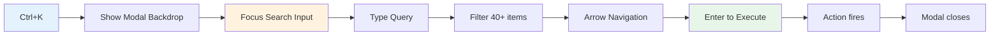

### Palette Items

| Group | Action | Shortcut |
|-------|--------|----------|
| Navigation | Go to Playground | G P |
| Navigation | Go to Sessions | G E |
| Navigation | Go to AI Providers | G A |
| Navigation | Go to Cloak Bridge | G C |
| Navigation | Go to Workspaces | G W |
| Navigation | Go to Knowledge Vault | G V |
| Navigation | Go to Learned Skills | G S |
| Navigation | Go to Watchers | G T |
| Navigation | Go to Outputs | G O |
| Actions | Create Vault Note | N N |
| Actions | Switch Workspace | W W |
| Actions | Launch Browser Profile | L L |
| Actions | Clear Chat | K K |
| Actions | Open Settings | S S |

## 5.5 Inspector Panel

### Behavior

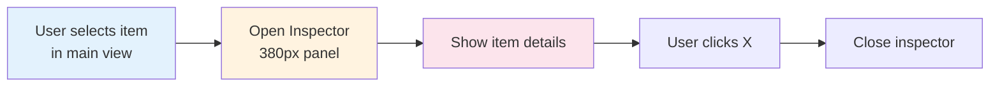

### Used In Views

| View | Inspector Content |
|------|-------------------|
| AI Providers | Provider config details |
| Workspaces | Workspace stats (docs, convos, skills, outputs) |
| Watchers | Watcher config + run history |
| Outputs | Document preview + actions |

## 5.6 Top Bar Circuit

```mermaid
graph LR
    subgraph "Top Bar"
        direction LR
        C[Context Area
        Workspace / Provider]
        S[Status Area
        Status Dot + "Idle"]
        A[Actions
        Quick Actions Button]
        N[Active Runs
        Count: 0]
    end

    style C fill:#e3f2fd
    style S fill:#fff3e0
    style A fill:#e8f5e9
    style N fill:#fce4ec
```

| Element | Source | Updates |
|---------|--------|---------|
| Workspace Label | First workspace loaded | On workspace switch |
| Provider Label | First provider loaded | On provider change |
| Status Dot | Run state | Every 5s polling |
| Active Runs | stats/list IPC | Every 5s polling |

## 5.7 Live Viewport

**Purpose**: Real-time browser session display during orchestration.

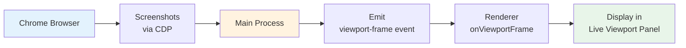

## 5.8 Run Inspector Modal

**Purpose**: Detailed view of a specific agent run.

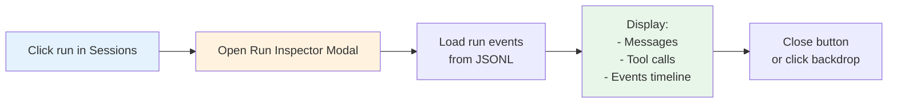

## 5.9 Screen-by-Screen Specifications

### 5.9.1 Playground View

**File**: `views/playground-view.ts`

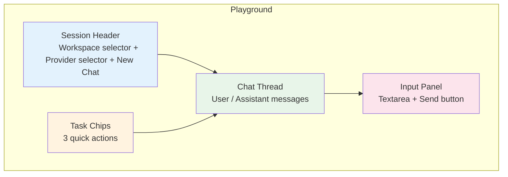

**Features**:
- Session header with workspace/provider selectors
- 3 suggested task chips ("Inspect a portal", "Ingest a file", "Draft a document")
- `<textarea>` for message input with send button
- Assistant responses styled with explainer blocks
- Empty state with onboarding guidance

### 5.9.2 Knowledge Vault View

**File**: `vault.ts`

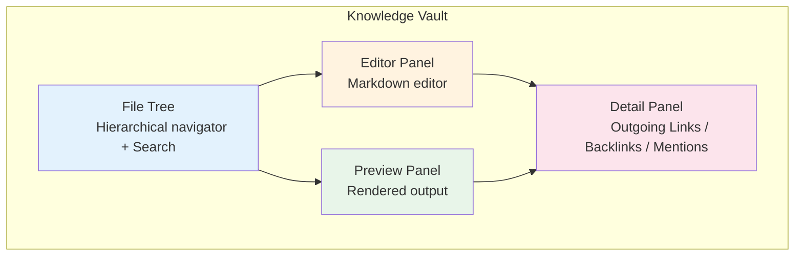

**Features**:
- File tree with hierarchical markdown file listing
- Search input (`#vault-search`)
- Split-pane editor + preview (WYSIWYG)
- Outgoing Links panel (links FROM current note)
- Backlinks panel (links TO current note)
- Mentions panel (contextual references)

### 5.9.3 AI Providers View

**File**: `views/providers-view.ts`

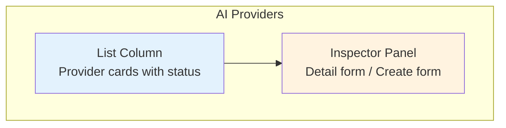

**Features**:
- Two-column layout (list left, detail inspector right)
- Preset provider grid (Anthropic, OpenAI, Custom)
- Connection health indicator in cards
- API key field with masked input (dots)
- Model selector dropdown
- Test connection button

### 5.9.4 Cloak Bridge (Profiles) View

**File**: `views/profiles-view.ts`

```mermaid
graph TB
    subgraph "Cloak Bridge"
        EB[Explainer Block
        "What is CloakBridge?"]
        PL[Profile List
        Cards with status]
        CA[Create Actions
        Add profile button]
    end

    EB --> PL
    EB --> CA

    style EB fill:#e3f2fd
    style PL fill:#fff3e0
    style CA fill:#e8f5e9
```

**Features**:
- Explainer block describing CloakBridge purpose
- Profile cards with status badges (active/expired/locked)
- Target domains list per profile
- Last checked timestamp
- Actions: Launch Login, Lock, Unlock, Delete
- Create profile form (name, profileDir, cdpUrl, targetDomains)

### 5.9.5 Ingestion View

**File**: `views/ingestion-view.ts`

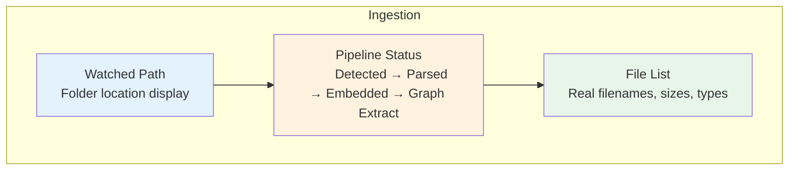

**Features**:
- Watched folder path display
- Pipeline phase indicators (4 steps with status)
- File list with real filenames (not UUIDs)
- File size, MIME type, and status badges
- Retry failed jobs button

### 5.9.6 Watchers View

**File**: `views/watchers-view.ts`

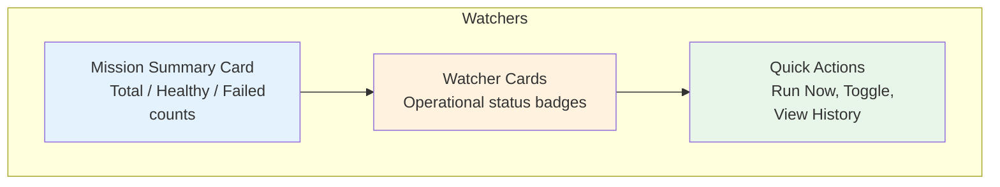

**Features**:
- Mission summary card (total, healthy, failed counts)
- Watcher cards with status badges:
  - 🟢 Healthy | Last run succeeded
  - 🔴 Failed | Last run failed
  - 🟡 Paused | Currently not running
  - 🟠 Running | Active execution
  - ⚪ Never Run | Not yet executed
- Quick actions: Run Now, Toggle on/off, View Logs
- Cron expression display (converted to human-readable text)
- Inspector panel for detail editing

### 5.9.7 Outputs View

**File**: `views/outputs-view.ts`

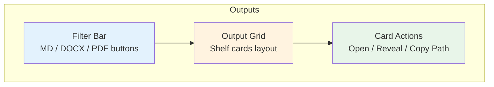

**Features**:
- Filter buttons by format (MD, DOCX, PDF)
- Shelf card layout
- Format badges per card
- Creation date, preview snippet
- Quick actions: Open, Reveal in folder, Copy path

### 5.9.8 Learned Skills View

**File**: `views/skills-view.ts`

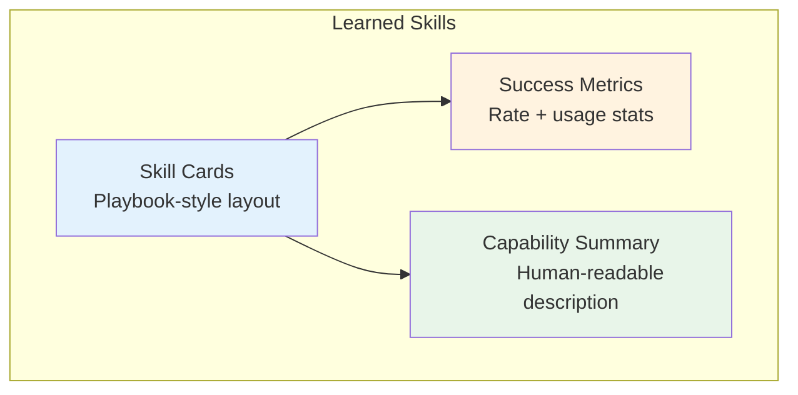

**Features**:
- Skill cards with playbook-style layout
- Success rate metrics with color coding
- Execution count (success/failure)
- Tool sequence display
- Pin/unpin for quick access
- Human-readable capability summaries

## 5.10 Design System

### 5.10.1 Typography Scale

| Token | Size | Usage |
|-------|------|-------|
| `--font-xs` | 11px | Metadata, badges, timestamps |
| `--font-sm` | 12px | Labels, secondary text |
| `--font-base` | 14px | Body text, primary content |
| `--font-lg` | 17px | Section titles |
| `--font-xl` | 20px | Page titles |

### 5.10.2 Icon System

All icons rendered via CSS pseudo-elements. **Zero Unicode symbols** in source files.

```mermaid
graph LR
    HTML[HTML Element<br/>class="icon-playground"] --> CSS[CSS ::before<br/>content: "●"]
    CSS --> RENDER[Rendered Icon]
    
    style HTML fill:#e3f2fd
    style CSS fill:#fff3e0
    style RENDER fill:#e8f5e9
```

### 5.10.3 Status Colors

| Status | Color | Usage |
|--------|-------|-------|
| Success | Green | Health OK, completed |
| Danger | Red | Failed, expired |
| Warning | Yellow | Paused, caution |
| Info | Blue | Running, in-progress |
| Neutral | Gray | Idle, unknown |

### 5.10.4 Zero Inline Styles Policy

```mermaid
graph LR
    A[Before] --> B[HTML style="margin-left:auto"]
    B --> C[CSS .status-dot-sm]
    C --> D[After]
    D --> E[CSS class only]
    
    style A fill:#ffebee
    style D fill:#e8f5e9
```

| Metric | Value |
|--------|-------|
| Inline styles in renderer.ts | 0 |
| Inline styles in index.html | 0 |
| CSS-driven icon classes | 19 |
| Empty state icon classes | 15 |
