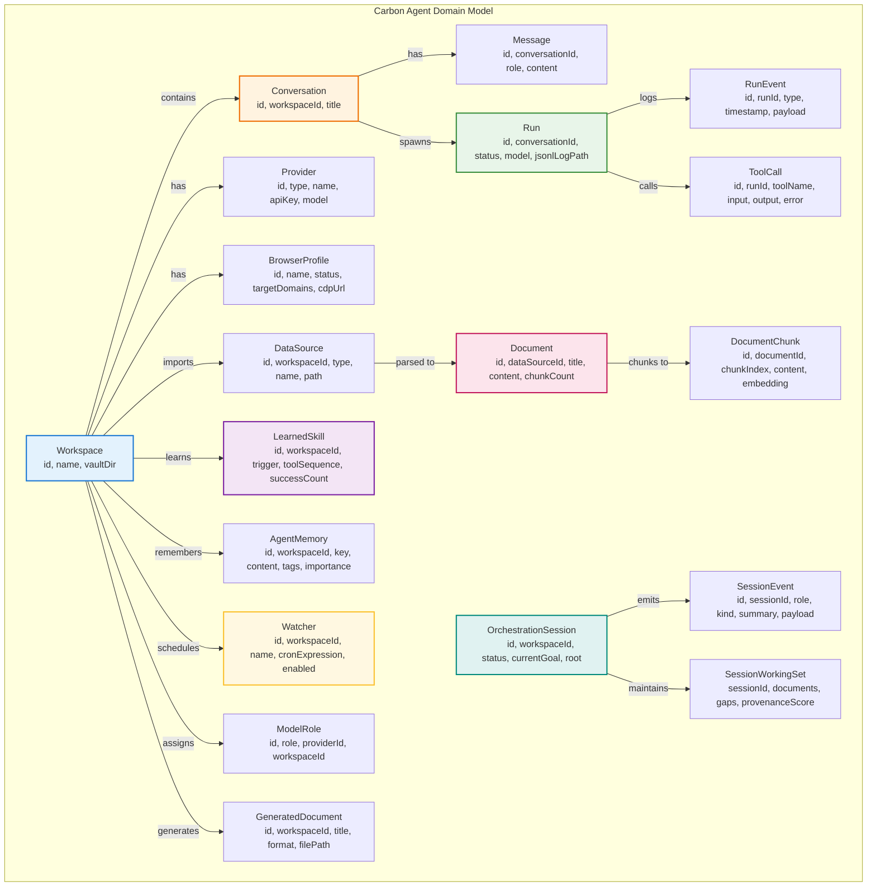
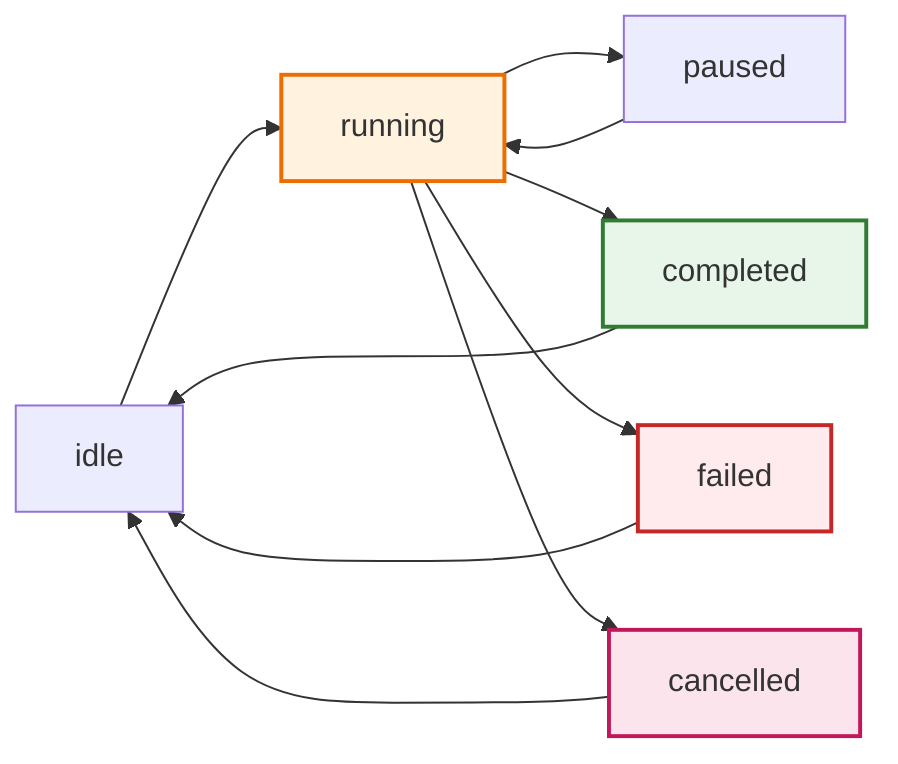
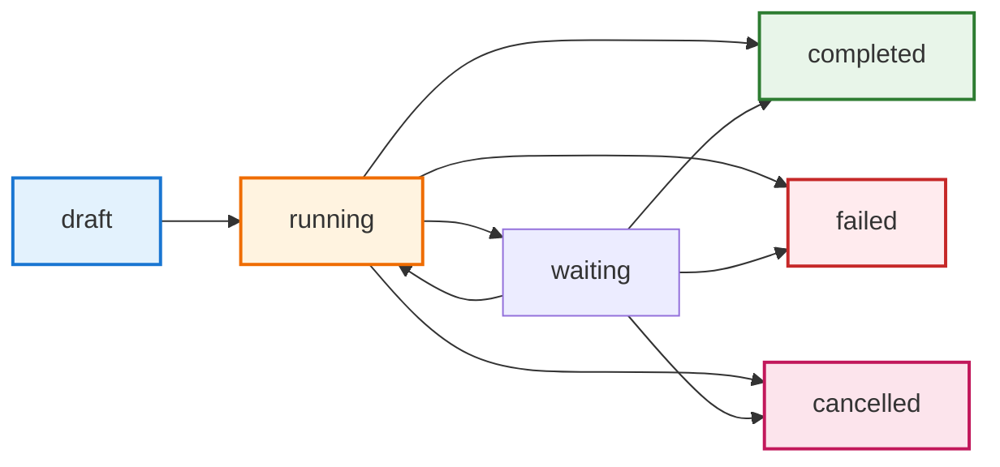
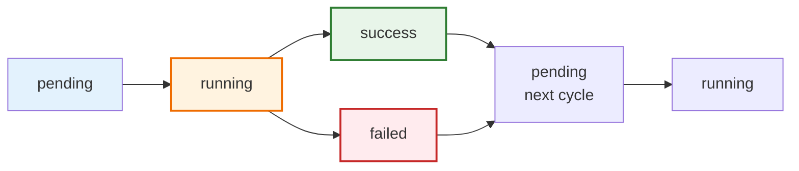
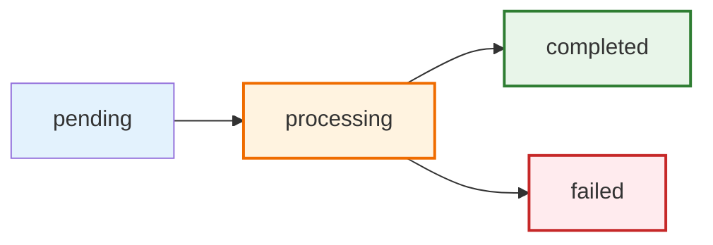
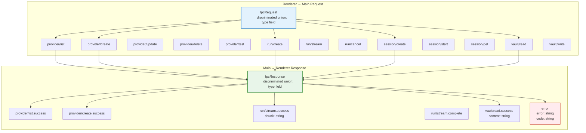
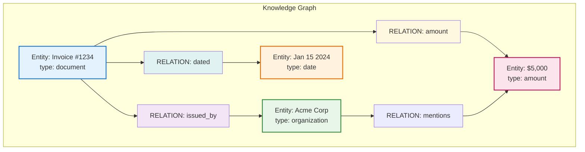

# 6. Data Models & Schemas

## 6.1 Entity Relationship Diagram



## 6.2 Workspace-Centric Model

```mermaid
graph TB
    subgraph "Workspace Isolation"
        W1[Workspace A
        Client: Acme Corp]
        W2[Workspace B
        Client: Globex]
    end
    
    W1 --> V1[Vault Files
    ~/.carbon-agent/vault/{uuid}/]
    W1 --> D1[Documents Chunks
    RAG Queries]
    W1 --> R1[Runs Log
    ~/.carbon-agent/logs/]
    W1 --> S1[Skills Learned
    Acme patterns]
    W1 --> M1[Memories
    Acme context]
    
    W2 --> V2[Vault Files
    ~/.carbon-agent/vault/{uuid}/]
    W2 --> D2[Documents Chunks]
    W2 --> R2[Runs Log]
    W2 --> S2[Skills Learned
    Globex patterns]
    W2 --> M2[Memories
    Globex context]
    
    style W1 fill:#e3f2fd,stroke:#1976d2,stroke-width:2px
    style W2 fill:#fff3e0,stroke:#ef6c00,stroke-width:2px
    style V1 fill:#e8f5e9
    style D1 fill:#fce4ec
    style S1 fill:#f3e5f5
```

## 6.3 Run Lifecycle State Machine



## 6.4 Orchestration Session State Machine



## 6.5 Watcher State Machine



## 6.6 Document Processing State Machine



## 6.7 IPC Request/Response Flow



## 6.8 Data Flow: Playground Chat

```mermaid
graph LR
    subgraph "User Action"
        U[Type message
        Click Send]
    end
    subgraph "Renderer"
        R1[playground-view.ts
        render message bubble]
        R2[carbonAPI.invoke
        request: run/stream]
    end
    subgraph "Preload"
        P[preload.ts
        ipcRenderer.invoke]
    end
    subgraph "Main"
        M[ipc-handlers.ts
        case "run/stream"]
        A[agent-runner.ts
        runAgent]
        AG[core-runtime
        agent.ts
        Stream LLM]
        DB[SQLite
        messages, runs, run_events]
        LOG[JSONL
        append events]
    end
    subgraph "Stream Back"
        E[Main emits
        session-update event]
        PS[Preload receives
        onSessionUpdate]
        PR[Renderer updates
    chat in real-time]
    end

    U --> R1
    R1 --> R2
    R2 --> P
    P --> M
    M --> A
    A --> AG
    A --> DB
    A --> LOG
    AG --> E
    E --> PS
    PS --> PR

    style R1 fill:#e3f2fd
    style M fill:#fff3e0
    style AG fill:#fce4ec
    style PR fill:#e8f5e9
```

## 6.9 Knowledge Graph Data Model



## 6.10 Factories (Data Creation Patterns)

```mermaid
graph LR
    subgraph "Factory Pattern"
        F1[createProvider(type, name, apiKey, model)
        → AIProviderConfig]
        F2[createWorkspace(name, vaultDir)
        → Workspace]
        F3[createRun(conversationId, providerId)
        → Run]
        F4[createWatcher(workspaceId, name, cron, prompt)
        → Watcher]
        F5[createSession(workspaceId, root, goal)
        → OrchestrationSession]
        F6[createSkill(workspaceId, trigger, toolSequence)
        → LearnedSkill]
    end

    F1 --> DB[SQLite INSERT]
    F2 --> DB
    F3 --> DB
    F4 --> DB
    F5 --> DB
    F6 --> DB

    style F1 fill:#e3f2fd
    style DB fill:#e8f5e9,stroke:#2e7d32,stroke-width:2px
```
