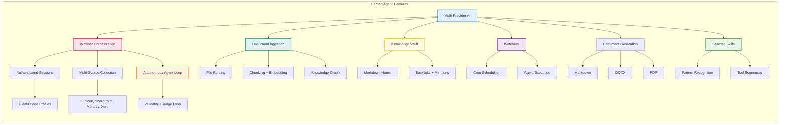
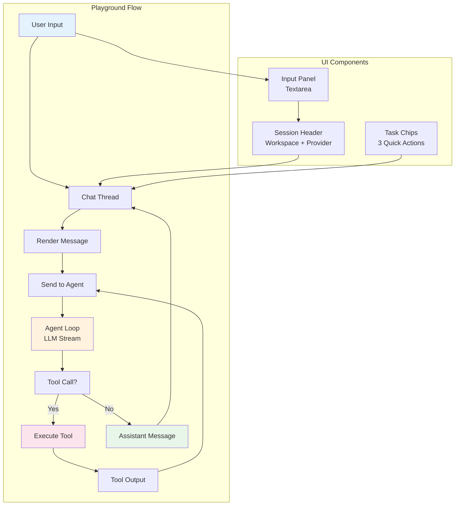
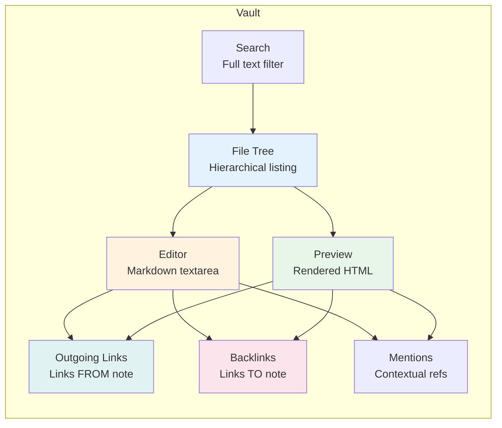
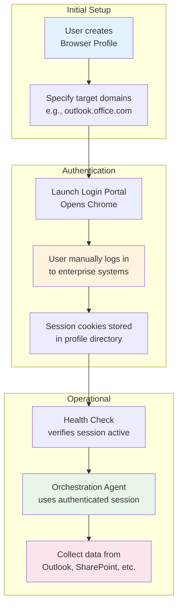
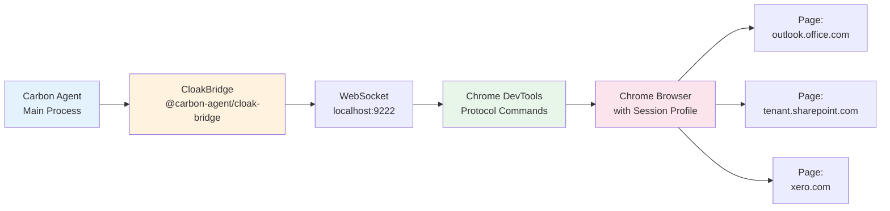
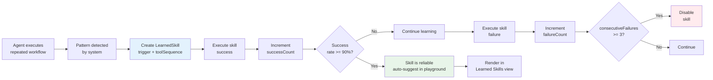
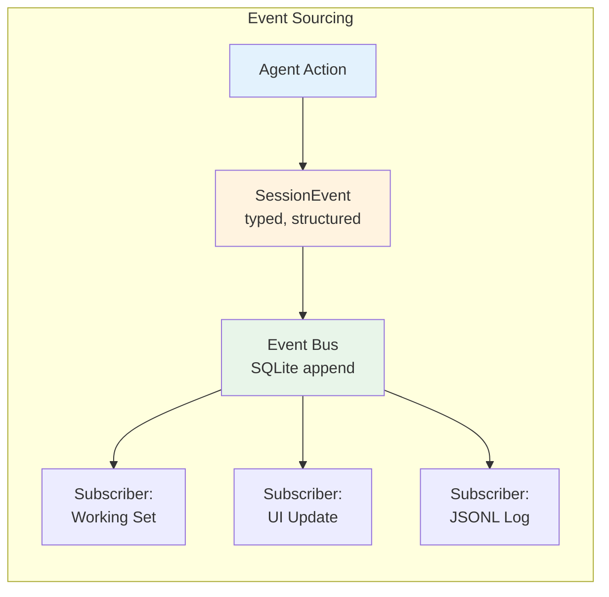

# 7. Core Features

## 7.1 Feature Map



## 7.2 Playground (Chat)

### Feature Diagram



### Pipeline Messages

```
User Message → Tool Call Decision → Tool Execution → Result Added → Continue Stream
```

## 7.3 Knowledge Vault

### Vault Architecture



### File Path Resolution

```mermaid
graph LR
    W[workspaceId
    e.g., "abc123"] --> P[Vault Directory
    ~/.carbon-agent/vault/abc123/]
    P --> F1[note.md]
    P --> F2[projects/client-a.md]
    P --> F3[research/2024-q1.md]
    
    style W fill:#e3f2fd
    style P fill:#fff3e0
    style F1 fill:#e8f5e9
```

## 7.4 Browser Orchestration

### Authentication Flow



### CDP Communication Flow



## 7.5 Document Ingestion

### Pipeline Architecture

```mermaid
graph TB
    subgraph "Source"
        F1[PDF file]
        F2[DOCX file]
        F3[Markdown file]
        F4[TXT file]
    end

    subgraph "Parse"
        P1[PDF parser
    (pdf-parse / pdf-lib)]
        P2[DOCX parser
    (mammoth)]
        P3[MD parser
    (native)]
        P4[TXT parser
    (native)]
    end

    subgraph "Chunk"
        C[Split into ~500
        token chunks]
    end

    subgraph "Embed"
        E[Xenova Transformers
    Local embedding model]
    end

    subgraph "Graph"
        G[Extract entities
        Build relations]
    end

    subgraph "Store"
        S1[data_sources table]
        S2[documents table]
        S3[document_chunks table]
    end

    F1 --> P1 --> C --> E --> G --> S3
    F2 --> P2 --> C --> E --> G --> S3
    F3 --> P3 --> C --> E --> G --> S3
    F4 --> P4 --> C --> E --> G --> S3
    P1 --> S1
    P2 --> S1
    P3 --> S1
    P4 --> S1
    C --> S2

    style F1 fill:#e3f2fd
    style P1 fill:#fff3e0
    style E fill:#e8f5e9
    style G fill:#fce4ec
    style S3 fill:#e0f2f1
```

## 7.6 Document Generation

### Generation Flow

```mermaid
graph LR
    subgraph "Input"
        T[Title
        e.g., "Q1 Report"]
        C[Content
        Markdown body]
        F[Format
    enum: md | docx | pdf]
    end

    subgraph "Processing"
        V[Validate format]
        BR{Format?}
        M1[Generate MD]
        M2[Generate DOCX
    docx library]
        M3[Generate PDF
    pdf-lib library]
    end

    subgraph "Output"
        P[Save to vault path]
        R[Record in DB
    generated_documents table]
    end

    T --> V
    C --> V
    F --> V
    V --> BR
    BR -->|md| M1
    BR -->|docx| M2
    BR -->|pdf| M3
    M1 --> P
    M2 --> P
    M3 --> P
    P --> R

    style F fill:#e3f2fd
    style BR fill:#fff3e0
    style P fill:#e8f5e9
```

## 7.7 RAG (Retrieval-Augmented Generation)

### Retrieval Flow

```mermaid
graph LR
    Q[User Query
    e.g., "What was Q1 revenue?"] --> EM[Generate
    Query Embedding]
    EM --> VS[Vector Search
    SQLite cosine similarity]
    VS --> R1[Chunk 42
    from invoice.pdf]
    VS --> R2[Chunk 7
    from report.docx]
    VS --> R3[Chunk 15
    from meeting.md]
    R1 & R2 & R3 --> C[Combine chunks
    into context]
    C --> P[Build prompt:
    "Given context: ..."]
    P --> L[Stream to LLM]
    L --> A[Assistant Response
    with sourced facts]

    style Q fill:#e3f2fd
    style EM fill:#fff3e0
    style VS fill:#fce4ec
    style A fill:#e8f5e9
```

## 7.8 Watchers (Scheduled Tasks)

### Watcher Architecture

```mermaid
graph TB
    subgraph "Definition"
        W[Watcher
        e.g., "Daily Report Check"]
        W --> N[Name]
        W --> P[Prompt
        "Check for new invoices"]
        W --> C[Cron
        "0 9 * * 1"]
        W --> E[Enabled: true]
        W --> PR[Profile: Acme Auth]
    end

    subgraph "Execution Loop"
        T[Parse cron
    with cron-parser] --> NX[Next run time
    e.g., next Monday 9am]
        NX --> TM[Set timer]
        TM --> FI[Fires]
        FI --> EX[Execute agent run]
        EX --> R{Result?}
        R -->|success| S[success status]
        R -->|fail| F[failed status]
        S --> N2[Schedule next run]
        F --> N2
    end

    style W fill:#e3f2fd
    style P fill:#fff3e0
    style EX fill:#e8f5e9
    style S fill:#fce4ec
```

## 7.9 Learned Skills

### Skill Lifecycle



### Skill Data Model

```mermaid
graph LR
    S[LearnedSkill] --> T[Trigger
    e.g., "generate report"]
    S --> SQ[ToolSequence
    ordered array]
    S --> SC[SuccessCount
    integer]
    S --> FC[FailureCount
    integer]
    S --> CC[ConsecutiveFailures
    integer]
    S --> V[Version
    integer]
    S --> P[Pinned
    boolean]
    
    SQ --> TS1[Step 1:
    stealth_open(url)]
    SQ --> TS2[Step 2:
    stealth_scrape(selector)]
    SQ --> TS3[Step 3:
    generate_document(...)]

    style S fill:#e3f2fd
    style T fill:#fff3e0
    style SQ fill:#e8f5e9
    style P fill:#fce4ec
```

## 7.10 CLI Detection

### Sub-Agent Integration

```mermaid
graph LR
    subgraph "CLI Detection"
        D[detectAllClis()] --> C1[Check Claude Code
     npm list -g @anthropic-ai/claude-code]
        D --> C2[Check Codex
     npm list -g openai-codex]
        C1 --> R1[{cli: "claude-code"
     installed: true/false
     version: "x.x.x"}]
        C2 --> R2[{cli: "codex"
     installed: true/false}]
    end

    subgraph "Agent Delegation"
        A[Agent decides
code task needed] --> R1
        A --> R2
        R1 --> L1[Launch
claude-code]
        R2 --> L2[Launch
codex]
        L1 --> ET[Execute task
in terminal]
        ET --> CD[Capture output
to JSONL log]
    end

    style D fill:#e3f2fd
    style A fill:#fff3e0
    style ET fill:#e8f5e9
```

## 7.11 Multi-Agent Orchestration

### Core Agent Collaboration

```mermaid
graph TB
    subgraph "Core Agents"
        M[Main Assistant
    User-facing]
        G[Goals Agent
    Defines "done"]
        P[Planner Agent
    Collection strategy]
        B[Browser Agent
    Authenticated ops]
        K[Knowledge Agent
    Working set]
        V[Validator Agent
    Quality gate]
        J[Judge Agent
    Sufficiency check]
    end

    M -->|request| G
    G -->|goals| P
    P -->|plan| B
    B -->|raw data| K
    K -->|normalized| V
    V -->|valid| J
    V -->|invalid| P
    J -->|insufficient| P
    J -->|sufficient| M
    M -->|spawn| S[Specialist
    Output agent]
    S -->|output| V

    style M fill:#e3f2fd,stroke:#1976d2,stroke-width:2px
    style B fill:#fce4ec,stroke:#c2185b,stroke-width:2px
    style K fill:#e0f2f1,stroke:#00897b,stroke-width:2px
    style V fill:#fff3e0,stroke:#ef6c00,stroke-width:2px
    style J fill:#e8f5e9,stroke:#388e3c,stroke-width:2px
    style S fill:#f3e5f5,stroke:#7b1fa2,stroke-width:2px
```

### Event Bus Architecture


