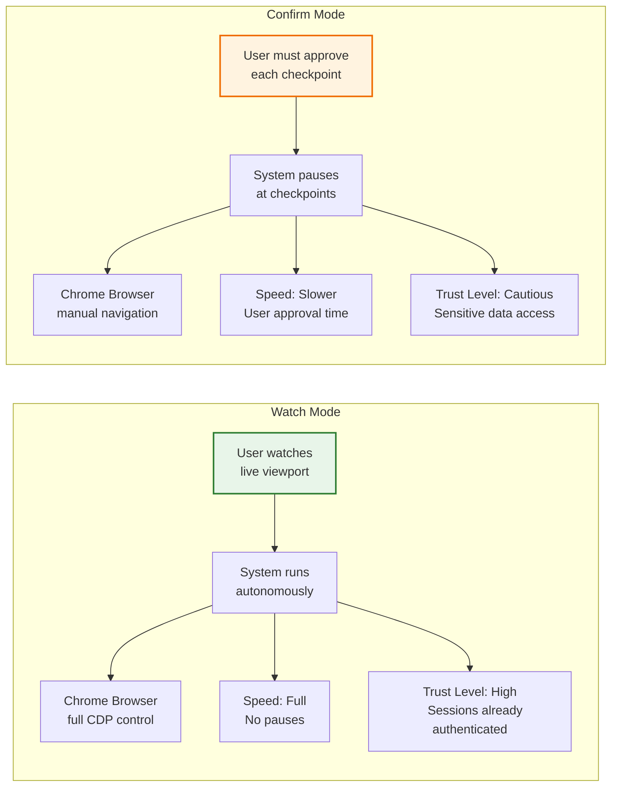
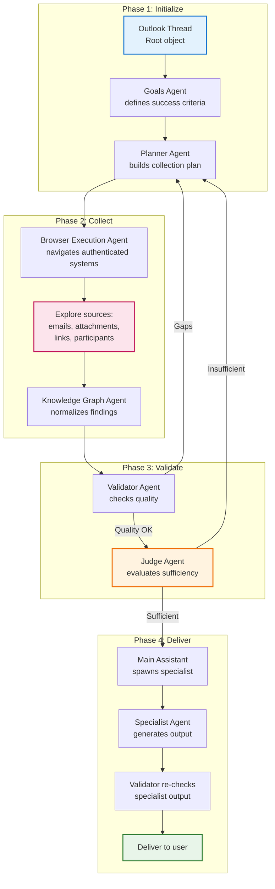
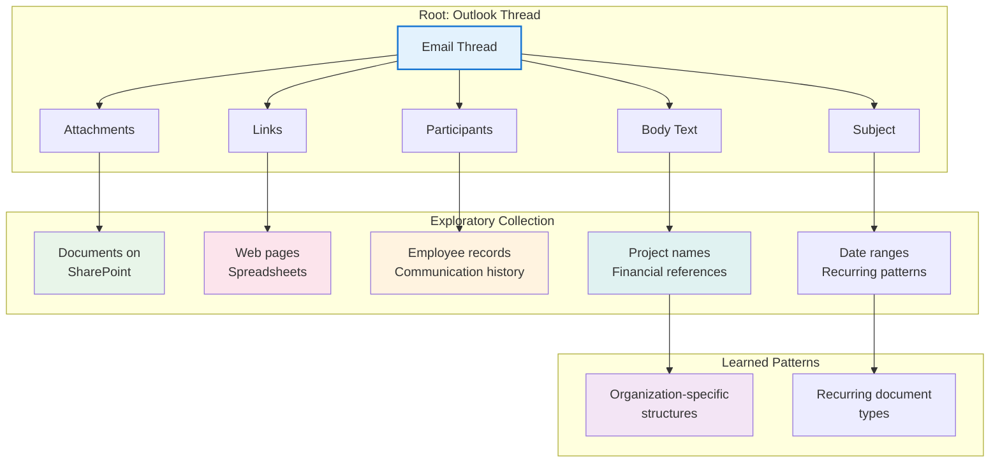
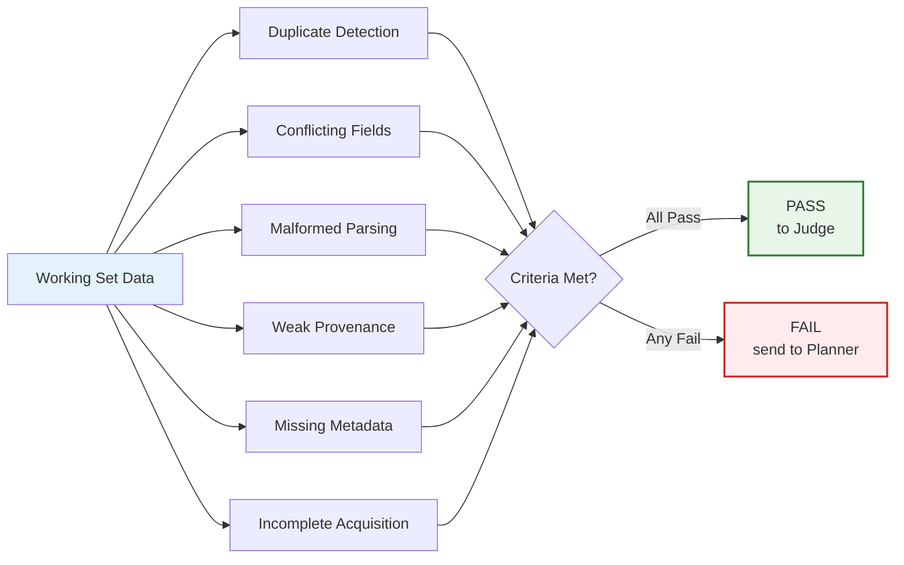
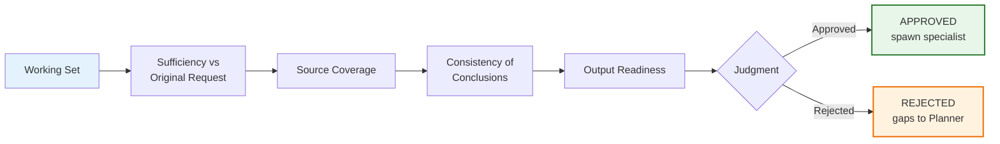
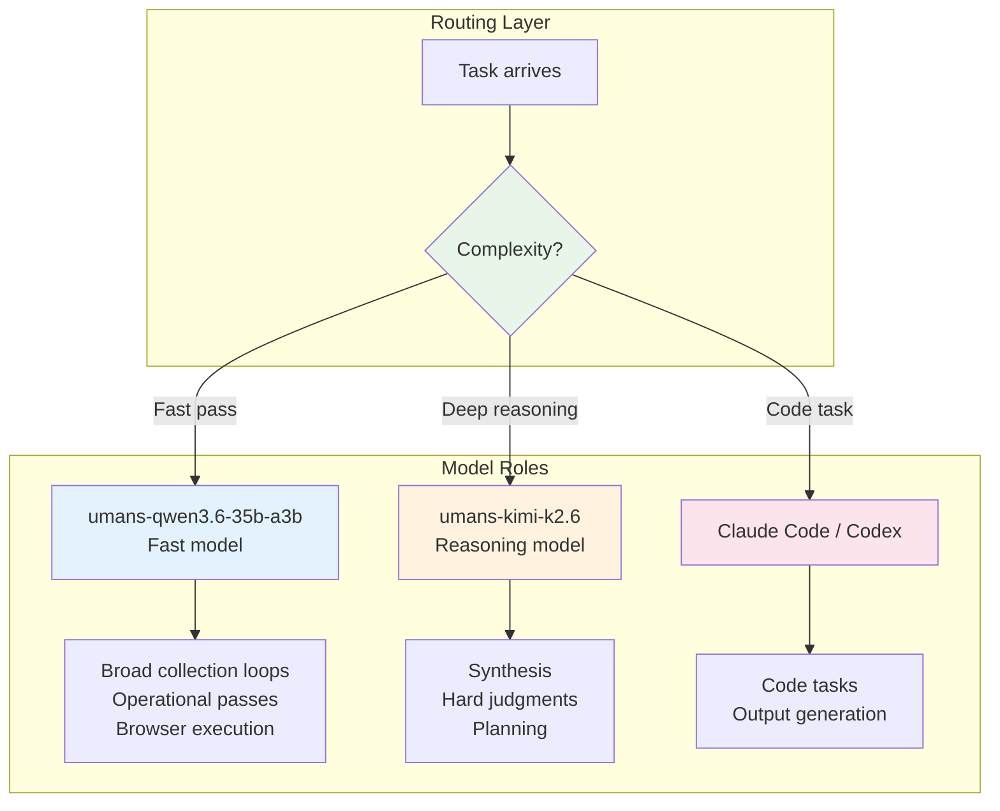
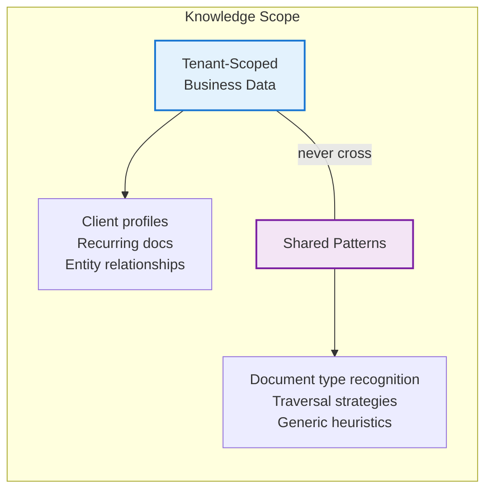
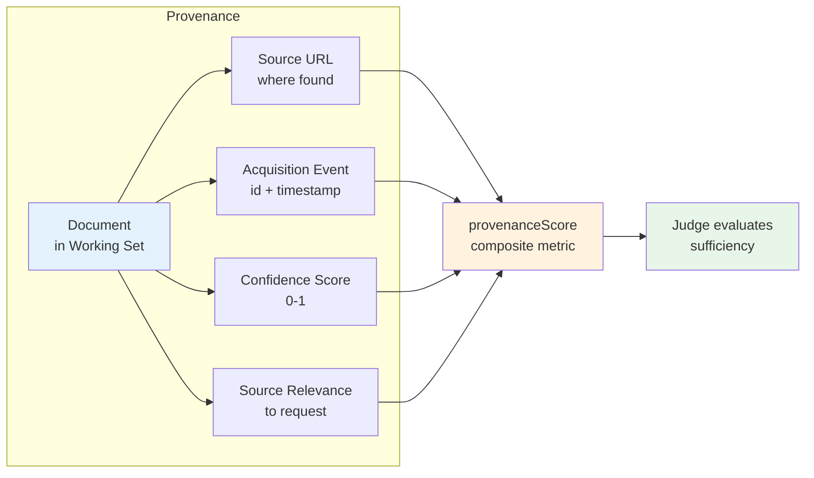

# 8. Browser Orchestration

> Reference: `docs/superpowers/specs/2026-06-06-carbon-agent-browser-orchestration-design.md`

## 8.1 Browser Orchestration Vision

```mermaid
graph TB
    subgraph "Enterprise User"
        U[User authenticates
        browser sessions]
        U --> A[Systems:
    Outlook, SharePoint,
    Monday, Xero, Sheets]
    end

    subgraph "Carbon Agent"
        R[User request
    e.g., "Summarize Q1 invoices"]
        R --> M[Main Assistant]
        M --> O[Orchestrator
    spawns agents]
    end

    subgraph "Autonomous Collection"
        O --> B[Browser Agent
    uses authenticated sessions]
        B --> D1[Outlook:
    Search emails]
        B --> D2[SharePoint:
    Download docs]
        B --> D3[Monday:
    Get project status]
        B --> D4[Xero:
    Extract financials]
        B --> D5[Sheets:
    Read data]
    end

    subgraph "Output"
        V[Validator confirms
    data quality]
        V --> J[Judge confirms
    sufficiency]
        J --> S[Specialist generates
    report / dashboard]
        S --> M2[Main Assistant
    presents to user]
    end

    D1 & D2 & D3 & D4 & D5 --> K[Knowledge Graph
    Working Set]
    K --> V

    style U fill:#e3f2fd
    style O fill:#fff3e0
    style B fill:#fce4ec
    style S fill:#e8f5e9
```

## 8.2 Two Supervision Modes



## 8.3 Orchestration Execution Flow



## 8.4 Source Expansion Strategy



## 8.5 Quality Gates

### Validator Quality Gates



### Judge Quality Gates



## 8.6 Session Root Object

```mermaid
graph LR
    subgraph "Session Root (v1)"
        S[SessionRootSchema] --> K[kind:
    "outlook-thread"]
        S --> T[threadId:
    email thread ID]
        S --> N[threadSubject:
    email subject]
        S --> M[mailbox:
    user@company.com]
    end

    style S fill:#e3f2fd,stroke:#1976d2,stroke-width:2px
```

## 8.7 Model Routing Strategy



## 8.8 Event-Sourced Architecture

```mermaid
graph TB
    subgraph "Event Log"
        E1[GoalDefined
    "Summarize Q1"]
        E2[PlanUpdated
    "Check Outlook + SharePoint"]
        E3[BrowserActionStarted
    "Navigate to SharePoint"]
        E4[BrowserActionCompleted
    "Downloaded report.docx"]
        E5[DocumentDiscovered
    "Found 3 similar docs"]
        E6[DocumentAcquired
    "Extracted text + tables"]
        E7[FieldExtracted
    "revenue: $120k"]
        E8[EntityResolved
    "Acme Corp (confirmed)"]
        E9[WorkingSetUpdated
    "12 docs, 8 entities"]
        E10[ValidationPassed
    "Zero duplicates found"]
        E11[JudgmentReturned
    "Sufficient (score: 0.92)"]
        E12[SpecialistSpawned
    "Financial Report Agent"]
        E13[SpecialistResultReceived
    "Q1_Summary.docx"]
        E14[OutputApproved
    "Ready for delivery"]
    end

    E1 --> E2 --> E3 --> E4 --> E5 --> E6 --> E7 --> E8 --> E9 --> E10 --> E11 --> E12 --> E13 --> E14

    style E1 fill:#e3f2fd
    style E11 fill:#fff3e0
    style E14 fill:#e8f5e9
    style E3 fill:#fce4ec
```

## 8.9 Persistent Knowledge



## 8.10 Session Data Model

```mermaid
graph TB
    subgraph "Orchestration Session"
        S[OrchestrationSession] --> ID[id]
        S --> W[workspaceId]
        S --> C[conversationId]
        S --> R[runId]
        S --> RT[root
    outlook-thread object]
        S --> SM[supervisionMode
    watch | confirm]
        S --> ST[status
    draft | running | waiting | completed | failed | cancelled]
        S --> CG[currentGoal
    string]
        S --> CS[completionSummary]
    end

    style S fill:#e3f2fd,stroke:#1976d2,stroke-width:2px
    style ST fill:#fff3e0
    style CG fill:#e8f5e9
```

## 8.11 Provenance Scoring


