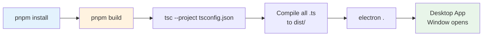
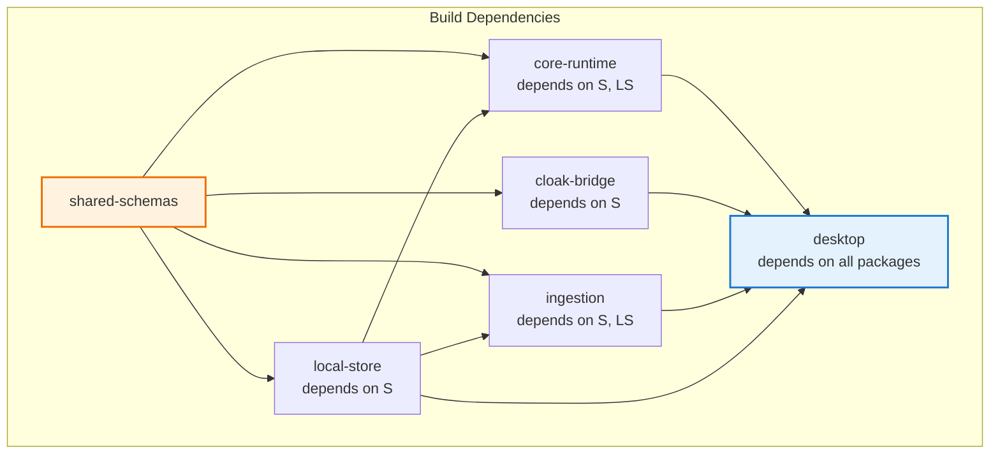
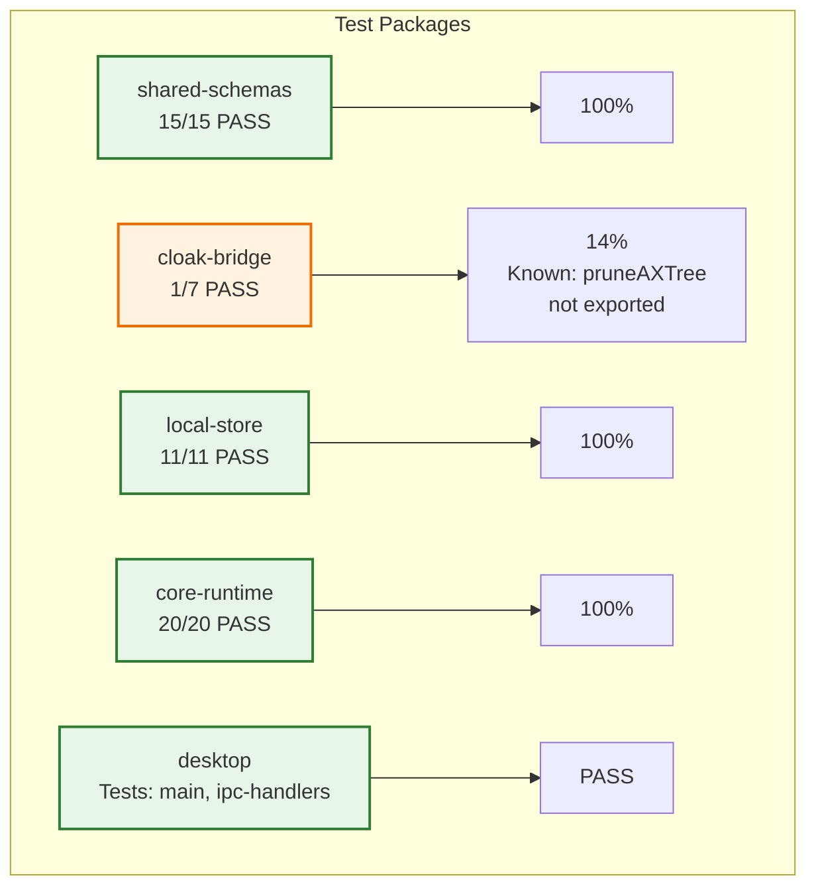
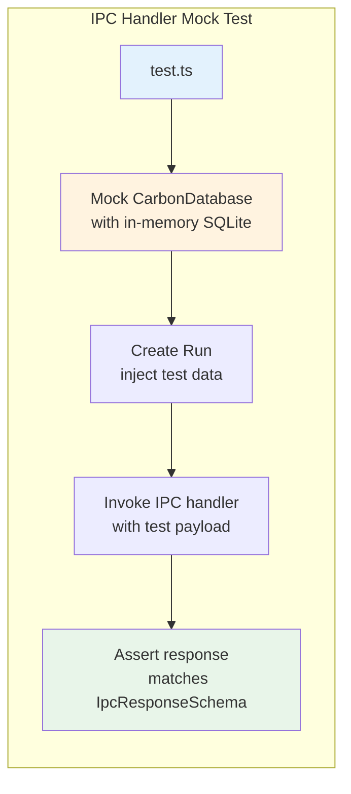
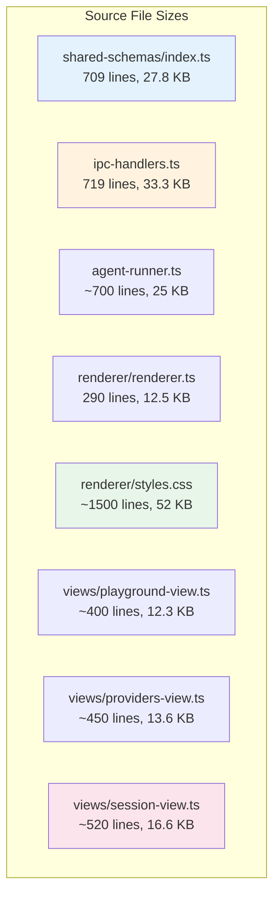
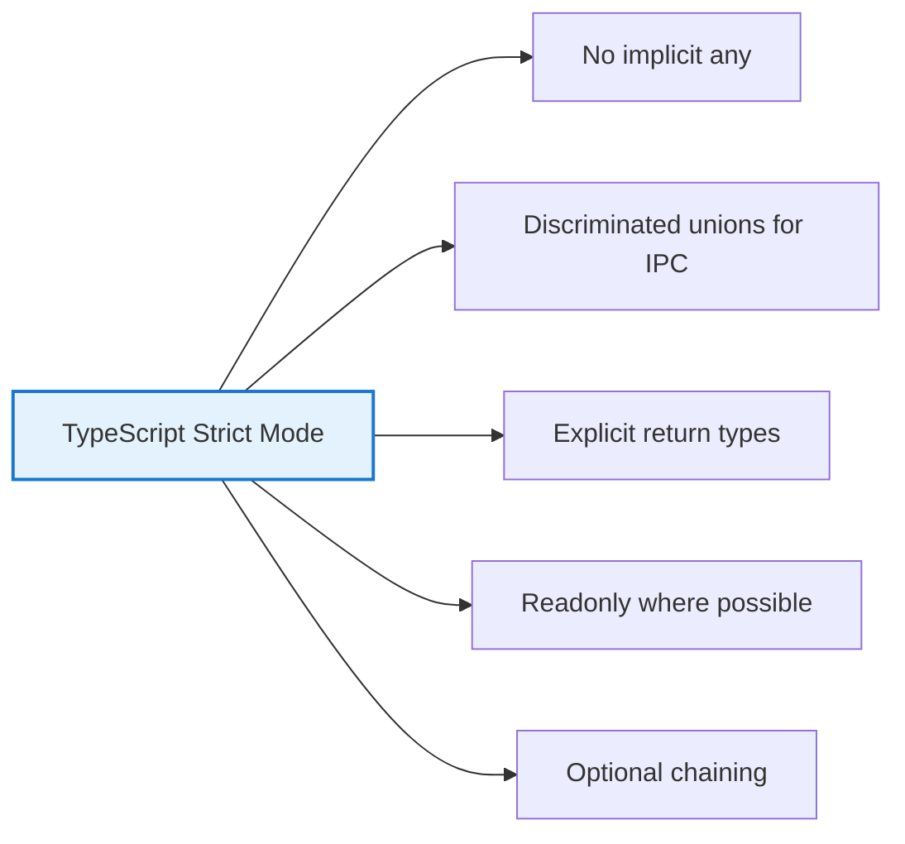
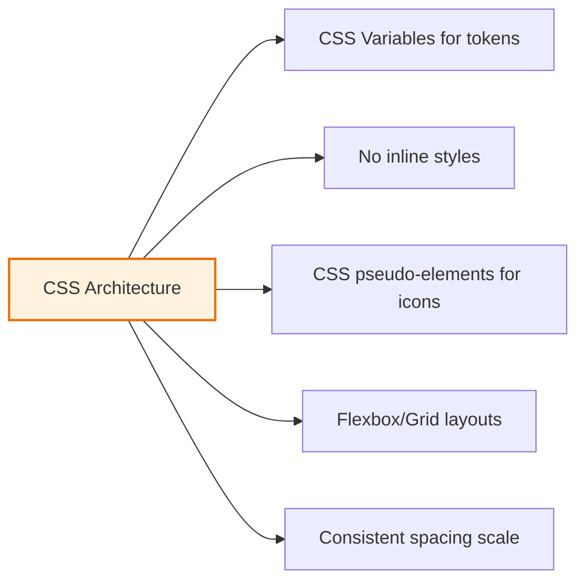
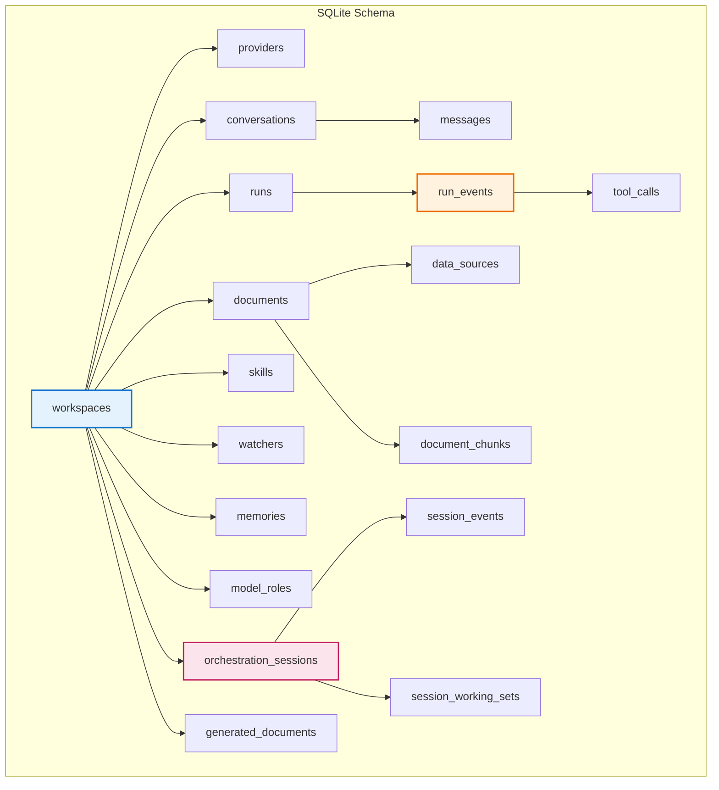
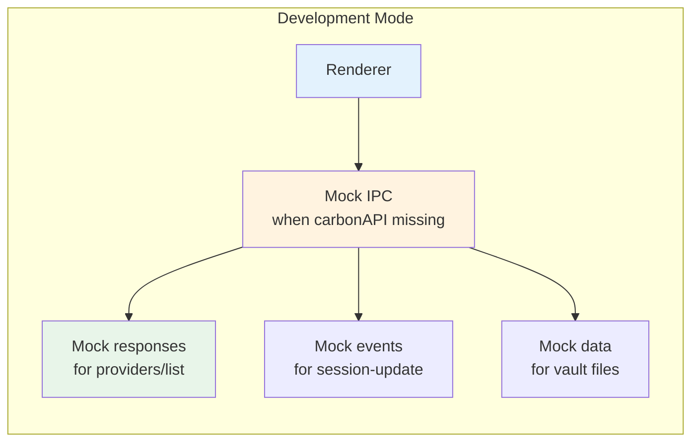

# 9. Developer Guide

## 9.1 Build & Run Workflow

### File: `apps/desktop/build.sh`



### Commands

```bash
# Install all dependencies across monorepo
pnpm install

# Build all packages (topological order)
pnpm build

# Type check all packages
pnpm typecheck

# Run all tests
pnpm test

# Start Electron dev mode
cd apps/desktop
pnpm dev          # or: electron .

# Lint
pnpm lint
pnpm lint:fix
```

## 9.2 Package Build Order



## 9.3 Testing Matrix

### Test Results



### Test Configuration

| Package | Config | Runner |
|---------|--------|--------|
| `apps/desktop` | `vitest.config.ts` | Vitest |
| `packages/core-runtime` | `vitest.config.ts` (implied) | Vitest |
| `packages/ingestion` | `vitest.config.ts` | Vitest |
| `packages/local-store` | `vitest.config.ts` | Vitest |
| `packages/shared-schemas` | `vitest.config.ts` | Vitest |

## 9.4 IPC Testing Pattern



## 9.5 File Size Reference



| Component | Lines | Size |
|-----------|-------|------|
| `renderer.ts` | 290 | 12.5 KB |
| `styles.css` | ~1500 | 52 KB |
| `playground-view.ts` | ~400 | 12.3 KB |
| `providers-view.ts` | ~450 | 13.6 KB |
| `session-view.ts` | ~520 | 16.6 KB |
| `profiles-view.ts` | ~330 | 10.5 KB |
| `skills-view.ts` | ~260 | 7.9 KB |
| `ipc-handlers.ts` | 719 | 33.3 KB |
| `shared-schemas/index.ts` | 709 | 27.8 KB |
| `agent-runner.ts` | ~700 | 25 KB |

## 9.6 Electron Security Checklist

```mermaid
graph LR
    subgraph "Security Layers"
        S1[contextIsolation: true
    renderer isolated from Node.js]
        S2[nodeIntegration: false
    no require() in renderer]
        S3[sandbox: true
    OS-level isolation]
        S4[Zod Validation
    All IPC validated]
        S5[AES-GCM Encryption
    API keys encrypted at rest]
        S6[Vault Path Validation
    Prevent path escape]
    end

    style S1 fill:#e8f5e9,stroke:#2e7d32,stroke-width:2px
    style S2 fill:#e8f5e9,stroke:#2e7d32,stroke-width:2px
    style S3 fill:#e8f5e9,stroke:#2e7d32,stroke-width:2px
    style S4 fill:#e8f5e9,stroke:#2e7d32,stroke-width:2px
    style S5 fill:#e8f5e9,stroke:#2e7d32,stroke-width:2px
    style S6 fill:#e8f5e9,stroke:#2e7d32,stroke-width:2px
```

| Security Feature | Status | File |
|------------------|--------|------|
| contextIsolation | ✅ Enabled | main.ts |
| nodeIntegration | ❌ Disabled | main.ts |
| sandbox | ✅ Enabled | main.ts |
| preload | ✅ Used | main.ts |
| Zod IPC | ✅ All validated | preload.ts, ipc-handlers.ts |
| AES-GCM | ✅ API keys encrypted | crypto.ts |
| Vault path check | ✅ `path.resolve()` validation | ipc-handlers.ts |

## 9.7 Code Style Standards

### TypeScript



### CSS



### Zero Unicode Policy

```mermaid
graph LR
    A[Before] --> B[Unicode symbols in HTML
    ◈ ◉ ◆ ⊞]
    B --> C[Problem: Emoji rendering
    inconsistency]
    C --> D[After]
    D --> E[CSS classes only
    .icon-playground { }]
    E --> F[All icons via ::before
    content: "●"]
    F --> G[Zero Unicode in renderer]

    style B fill:#ffebee
    style F fill:#e8f5e9,stroke:#2e7d32,stroke-width:2px
```

| Metric | Value |
|--------|-------|
| Inline styles in renderer.ts | 0 ✅ |
| Inline styles in index.html | 0 ✅ |
| Uncode symbols in renderer | 0 ✅ |
| CSS icon classes | 19 |
| Empty state icon classes | 15 |

## 9.8 Database Schema Quick Reference

### Table Listing



### Key Table Fields

| Table | Key Fields |
|-------|-----------|
| `workspaces` | id, name, vaultDir, createdAt, updatedAt |
| `providers` | id, type, name, apiKey (encrypted), baseUrl, model |
| `browser_profiles` | id, name, status, targetDomains, cdpUrl, profileDir |
| `conversations` | id, workspaceId, title, createdAt, updatedAt |
| `runs` | id, conversationId, status, model, jsonlLogPath |
| `run_events` | id, runId, type, timestamp, payload |
| `documents` | id, dataSourceId, title, content, chunkCount |
| `document_chunks` | id, documentId, chunkIndex, content, embedding |
| `skills` | id, workspaceId, trigger, toolSequence, successCount, pinned |
| `watchers` | id, workspaceId, name, prompt, cronExpression, enabled, status |
| `memories` | id, workspaceId, key, content, tags, importance, source |
| `orchestration_sessions` | id, workspaceId, status, currentGoal, rootJson, supervisionMode |
| `session_events` | id, sessionId, role, kind, summary, payload |
| `session_working_sets` | sessionId, documentsJson, gapsJson, provenanceScore |

## 9.9 Development Environment

### Required

| Dependency | Version |
|------------|---------|
| Node.js | >= 22.0.0 |
| pnpm | Latest |
| Electron | ^33.0.0 |
| TypeScript | ^5.7.0 |
| better-sqlite3 | Native module |

### Platform Targets

| Platform | Target | Icon |
|----------|--------|------|
| Windows | NSIS Installer | `assets/icon.ico` |
| macOS | DMG | `assets/icon.icns` |
| Linux | AppImage | `assets/icon.png` |

## 9.10 Mock API Development



**File**: `apps/desktop/src/renderer/mock-api.js` (9.2 KB)

Provides mock data for development without backend:
- Provider list (Anthropic, OpenAI mock)
- Workspace list
- Session events
- Vault file listing
- Watcher status
