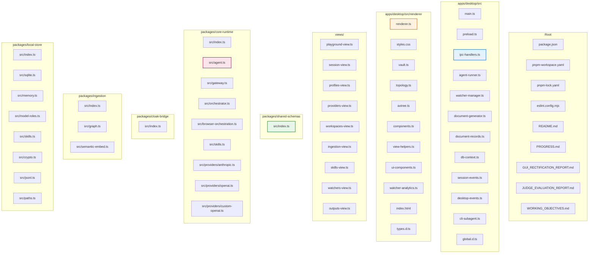
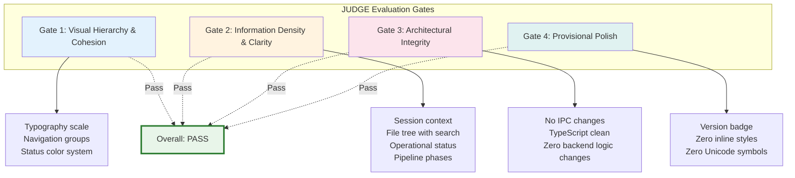
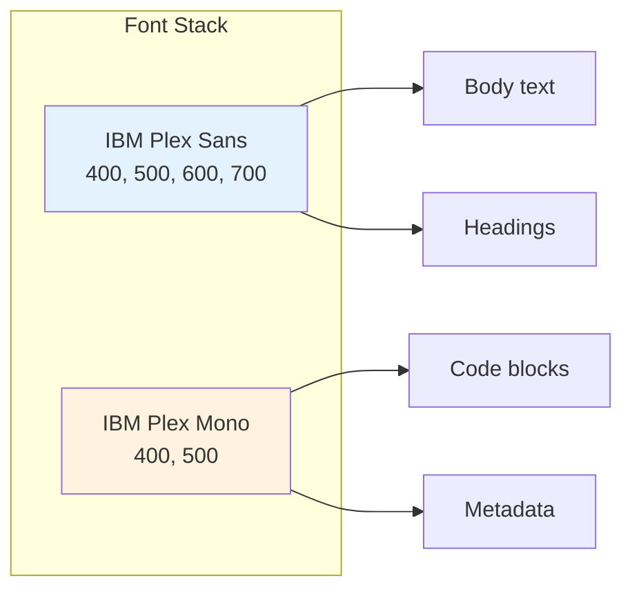
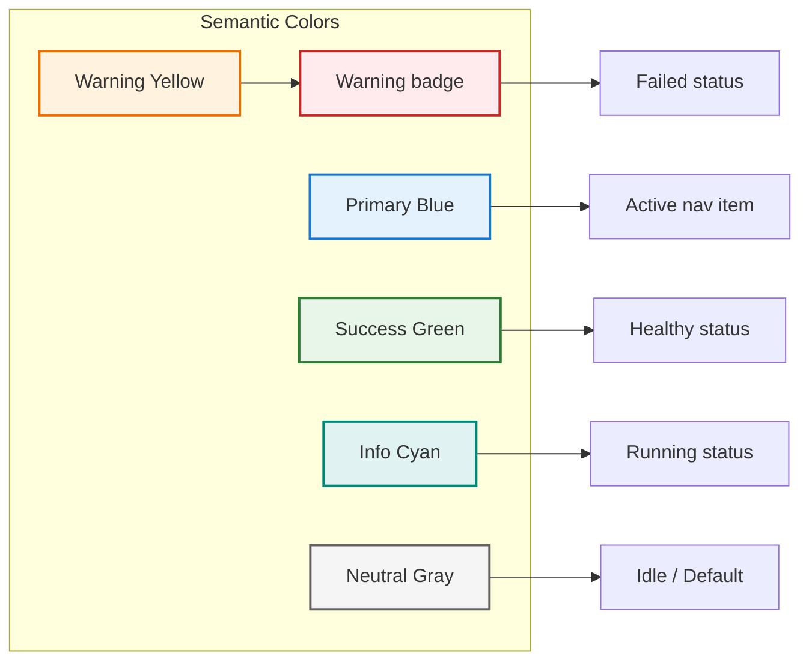
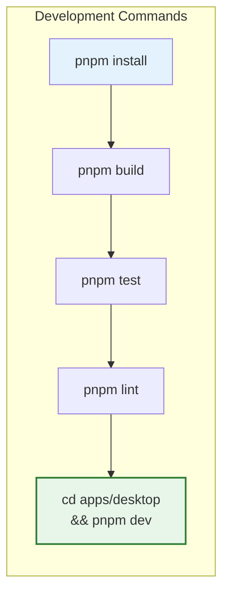

# 10. Appendix

## A.1 Complete File Inventory

### Monorepo Source Files (excluding node_modules, dist, .git)



## A.2 JUDGE Evaluation Framework

Quality gates used to evaluate all GUI iterations:



| Gate | Criteria | Iteration 6 Result |
|------|----------|-------------------|
| **Gate 1** | Visual hierarchy established, typography scale, nav groups | ✅ PASS |
| **Gate 2** | Session context, info density, inspector panel, pipeline phases | ✅ PASS |
| **Gate 3** | No IPC changes, strict UI-only, clean typecheck | ✅ PASS |
| **Gate 4** | Version badge design, zero inline styles, zero Unicode | ✅ PASS |

## A.3 Design System Tokens

### Typography



### Size Tokens

| Token | Value | Usage |
|-------|-------|-------|
| `--font-xs` | 11px | Metadata, timestamps, badges |
| `--font-sm` | 12px | Secondary labels, small text |
| `--font-base` | 14px | Body text, primary content |
| `--font-lg` | 17px | Section headings, card titles |
| `--font-xl` | 20px | Page titles |

### Layout Tokens

| Token | Value | Usage |
|-------|-------|-------|
| `--sidebar-width` | 200px | Navigation panel |
| `--sidebar-collapsed` | 60px | Collapsed nav (future) |
| `--topbar-height` | 48px | Top bar |
| `--inspector-width` | 380px | Right detail panel |
| `--border-radius` | 6px | Card corners |
| `--border-radius-sm` | 4px | Button corners |

### Spacing Scale

| Token | Value |
|-------|-------|
| `--space-xs` | 4px |
| `--space-sm` | 8px |
| `--space-md` | 12px |
| `--space-lg` | 16px |
| `--space-xl` | 24px |
| `--space-2xl` | 32px |

## A.4 Color System



## A.5 Icon System Reference

### CSS Icon Classes

```mermaid
graph LR
    subgraph "Navigation Icons"
        I1[.icon-playground]
        I2[.icon-sessions]
        I3[.icon-vault]
        I4[.icon-providers]
        I5[.icon-profiles]
        I6[.icon-workspace]
        I7[.icon-skills]
        I8[.icon-watcher]
        I9[.icon-output]
    end

    subgraph "Rendered Via CSS ::before"
        CSS[content: "●"]
    end

    I1 --> CSS
    I2 --> CSS
    I3 --> CSS

    style CSS fill:#e8f5e9,stroke:#2e7d32,stroke-width:2px
```

## A.6 Build Configuration

### Electron Builder Config

| Property | Value |
|----------|-------|
| `appId` | `com.corporatecarbon.carbon-agent` |
| `productName` | `Carbon Agent` |
| `outputDir` | `release/` |
| `files` | `dist/**/*`, `src/renderer/**/*` |
| `win.target` | `nsis` |
| `nsis.oneClick` | `false` |
| `nsis.allowToChangeInstallationDirectory` | `true` |
| `mac.target` | `dmg` |
| `linux.target` | `AppImage` |

## A.7 External Dependencies

### Production

| Package | Version | Purpose |
|---------|---------|---------|
| `electron` | ^33.0.0 | Desktop shell |
| `docx` | ^9.7.1 | Document generation |
| `pdf-lib` | ^1.17.1 | PDF manipulation |
| `better-sqlite3` | latest | SQLite driver |
| `zod` | latest | Schema validation |
| `@xenova/transformers` | ^2.17.2 | Local embeddings |
| `cron-parser` | ^5.5.0 | Cron expression parsing |

### Dev

| Package | Version | Purpose |
|---------|---------|---------|
| `typescript` | ^5.7.0 | Type checker |
| `vitest` | ^3.0.0 | Test runner |
| `electron-builder` | ^25.1.0 | App packaging |
| `eslint` | ^10.4.1 | Linter |
| `@electron/*` | ^33.0.0 | Electron types |

## A.8 License & Legal

```
All rights reserved.
Corporate Carbon Pty Ltd
```

## A.9 Version History

| Version | Date | Changes |
|---------|------|---------|
| 0.1.0 | 2026-06 | Initial release, all 15 views, browser orchestration spec |

## A.10 Quick Command Reference



| Task | Command |
|------|---------|
| Install deps | `pnpm install` |
| Build all | `pnpm build` |
| Type check | `pnpm typecheck` |
| Test all | `pnpm test` |
| Lint | `pnpm lint` |
| Fix lint | `pnpm lint:fix` |
| Start dev | `cd apps/desktop && pnpm dev` |
| Test desktop | `cd apps/desktop && pnpm test` |

---

## A.11 Wiki File Map

| File | Contents |
|------|----------|
| `WIKI.md` | Master index + quick reference |
| `01-SYSTEM-OVERVIEW.md` | Architecture at a glance |
| `02-ARCHITECTURE.md` | Detailed system architecture |
| `03-ELECTRON-APP.md` | Main process, IPC, agent runner |
| `04-PACKAGES.md` | Package reference & APIs |
| `05-USER-INTERFACE.md` | All 13 views + design system |
| `06-DATA-MODELS.md` | Entity relationships & state machines |
| `07-CORE-FEATURES.md` | Feature diagrams & flows |
| `08-BROWSER-ORCHESTRATION.md` | Multi-agent collection |
| `09-DEVELOPER-GUIDE.md` | Build, test, security |
| `10-APPENDIX.md` | File inventory, tokens, commands |

---

*Wiki Generated: 2026-06-06*
*Carbon Agent v0.1.0*
*Total Wiki Files: 11*
*Total Diagrams: 40+*
