# Carbon Agent — Local Wiki

> Enterprise document reasoning with authenticated browser sessions.
> Version: 0.1.0 | Last Updated: 2026-06-06

---

## Table of Contents

1. [System Overview](#1-system-overview)
2. [Architecture & Data Flow](#2-architecture--data-flow)
3. [Project Structure](#3-project-structure)
4. [Desktop Application (Electron)](#4-desktop-application-electron)
5. [Package Reference](#5-package-reference)
6. [User Interface](#6-user-interface)
7. [Data Models & Schemas](#7-data-models--schemas)
8. [Core Features](#8-core-features)
9. [Browser Orchestration](#9-browser-orchestration)
10. [Developer Guide](#10-developer-guide)
11. [Appendix](#11-appendix)

---

## 1. System Overview

### 1.1 What is Carbon Agent?

Carbon Agent is an Electron-based desktop application for **enterprise document reasoning**. It enables authenticated browser sessions to collect, process, and reason over documents from multiple sources (Outlook, SharePoint, Monday, Xero, spreadsheets, and local files).

### 1.2 Key Capabilities

| Capability | Description |
|------------|-------------|
| **Multi-Provider AI** | Anthropic, OpenAI, Custom OpenAI-compatible APIs |
| **Browser Authentication** | CloakBridge for persistent authenticated sessions |
| **Document Ingestion** | File parsing, chunking, embedding, local RAG |
| **Knowledge Vault** | Note-taking with backlinks, outgoing links, mentions |
| **Orchestration** | Multi-agent system for autonomous data collection |
| **Document Generation** | Markdown, DOCX, PDF output formats |
| **Watchers** | Cron-scheduled automated tasks |
| **CLI Integration** | Claude Code and Codex sub-agent support |

### 1.3 Technology Stack

| Layer | Technology |
|-------|------------|
| Frontend | Vanilla TypeScript, CSS Variables, Electron Renderer |
| Backend (Main) | Electron Main, Node.js 22+ |
| IPC | Electron IPC with Zod validation |
| Database | SQLite (via better-sqlite3) |
| Packages | pnpm workspace monorepo |
| Testing | Vitest |
| Styling | CSS Variables, Grid, Flexbox |

---

## 2. Architecture & Data Flow

### 2.1 System Architecture Diagram

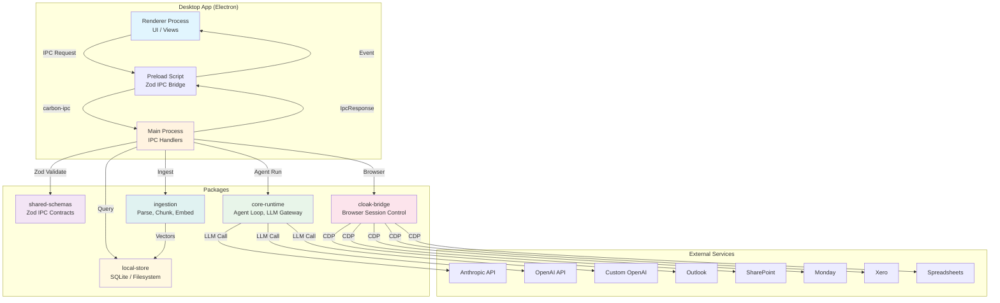

### 2.2 IPC Communication Flow

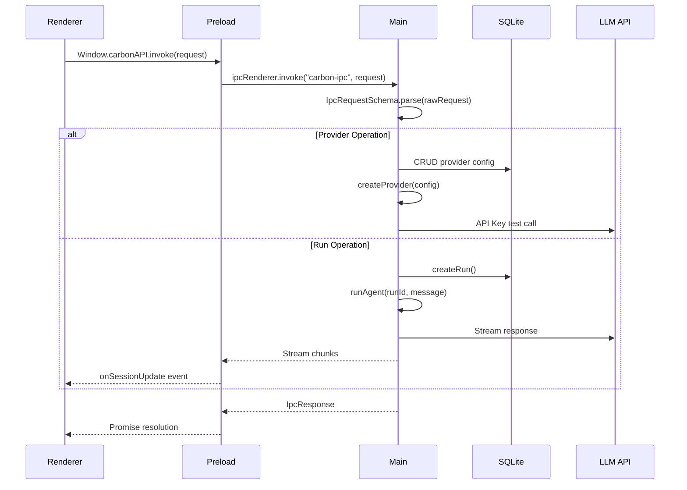

### 2.3 Document Processing Pipeline

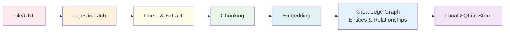

---

## 3. Project Structure

### 3.1 Monorepo Layout

```
carbon-agent/
├── apps/desktop/              # Electron desktop application
│   ├── src/
│   │   ├── main.ts            # Electron main process entry
│   │   ├── preload.ts         # IPC bridge (Zod validated)
│   │   ├── ipc-handlers.ts    # All IPC route handlers
│   │   ├── agent-runner.ts    # Agent execution orchestrator
│   │   ├── watcher-manager.ts # Cron job scheduler
│   │   ├── document-generator.ts  # DOCX/PDF/Markdown generation
│   │   ├── document-records.ts    # Generated document persistence
│   │   ├── db-context.ts      # Database connection context
│   │   ├── session-events.ts  # Session event emitters
│   │   ├── desktop-events.ts  # Desktop-wide event emitters
│   │   ├── cli-subagent.ts    # Claude Code/Codex detection
│   │   └── renderer/          # Frontend UI
│   │       ├── index.html     # Main HTML shell
│   │       ├── renderer.ts    # View router, CMDK palette
│   │       ├── styles.css     # Complete design system
│   │       ├── vault.ts       # Knowledge Vault view
│   │       ├── topology.ts    # Agent topology visualization
│   │       ├── axtree.ts      # Accessibility tree inspector
│   │       ├── components.ts  # Reusable UI components
│   │       ├── view-helpers.ts # Shared view utilities
│   │       ├── types.d.ts     # Renderer type definitions
│   │       ├── ui-components.ts # UI building blocks
│   │       ├── watcher-analytics.ts # Analytics dashboard
│   │       └── views/         # Screen views
│   │           ├── playground-view.ts     # Chat playground
│   │           ├── session-view.ts      # Session orchestration
│   │           ├── profiles-view.ts   # Cloak Bridge profiles
│   │           ├── providers-view.ts    # AI provider settings
│   │           ├── workspaces-view.ts   # Workspace management
│   │           ├── ingestion-view.ts    # File ingestion
│   │           ├── skills-view.ts       # Learned skills
│   │           ├── watchers-view.ts     # Task watchers
│   │           └── outputs-view.ts      # Document outputs
│   ├── dist/                  # Compiled JavaScript
│   ├── package.json           # Electron app manifest
│   └── tsconfig.json
│
├── packages/                  # Shared packages
│   ├── shared-schemas/        # Zod schemas for IPC + data models
│   │   └── src/index.ts       # All domain schemas (709 lines)
│   ├── core-runtime/          # Agent loop, providers, tools
│   │   └── src/
│   │       ├── index.ts       # Package exports
│   │       ├── agent.ts       # Agent execution engine
│   │       ├── gateway.ts     # LLM provider routing
│   │       ├── orchestrator.ts # Multi-agent orchestration
│   │       ├── browser-orchestration.ts # Browser automation
│   │       ├── skills.ts      # Skill registration & execution
│   │       └── providers/     # LLM provider implementations
│   │           ├── anthropic.ts
│   │           ├── openai.ts
│   │           └── custom-openai.ts
│   ├── cloak-bridge/          # Browser session management
│   │   └── src/index.ts       # CDP (Chrome DevTools Protocol)
│   ├── ingestion/             # Document processing pipeline
│   │   └── src/
│   │       ├── index.ts       # Ingestion orchestrator
│   │       ├── graph.ts       # Knowledge graph builder
│   │       ├── semantic-embed.ts # Vector embeddings
│   │       └── sql-js.d.ts    # sql.js type declarations
│   └── local-store/           # Data persistence layer
│       └── src/
│           ├── index.ts       # Package exports
│           ├── sqlite.ts      # SQLite database operations
│           ├── memory.ts      # Agent memory storage
│           ├── model-roles.ts  # Model role assignments
│           ├── skills.ts      # Learned skills storage
│           ├── crypto.ts      # Encryption utilities
│           ├── jsonl.ts       # JSONL log append operations
│           └── paths.ts       # File system path utilities
│
├── docs/superpowers/          # Architecture docs
│   ├── specs/                 # Design specifications
│   └── plans/                 # Implementation plans
├── package.json               # Root monorepo config
├── pnpm-workspace.yaml        # pnpm workspace definition
└── eslint.config.mjs        # Linting rules
```

---

## 4. Desktop Application (Electron)

### 4.1 Main Process Entry Point

**File**: `apps/desktop/src/main.ts`

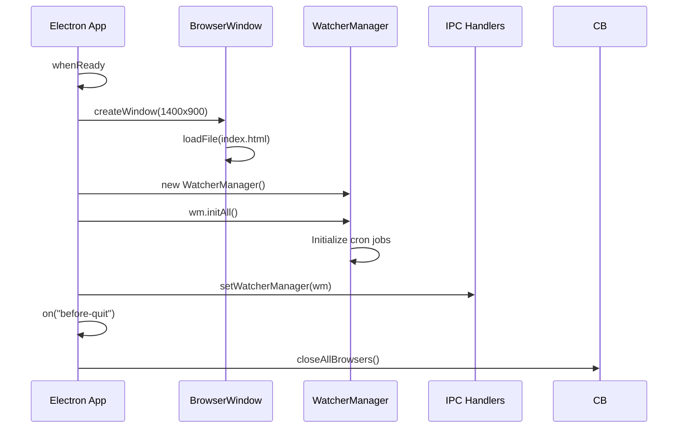

**Key Configuration**:
- Window: 1400×900 px
- Preload: `preload.js` with contextIsolation, sandbox enabled
- Node integration: Disabled (security)
- macOS app.on("activate") for proper dock behavior

### 4.2 Preload Script

**File**: `apps/desktop/src/preload.ts`

The preload script is the **security gateway** between renderer and main:

| Feature | Implementation |
|---------|---------------|
| IPC Bridge | `contextBridge.exposeInMainWorld("carbonAPI", api)` |
| Typed Invoke | Zod-validated `invoke(request)` → `Promise<IpcResponse>` |
| Event Listeners | Type-safe subscriptions for: viewport, topology, AXTree, analytics, vault, sessions |
| No raw Node.js | Only IPC channels, no fs/process access |

**Exposed API Channels**:
```typescript
interface CarbonAPI {
  invoke(request: IpcRequest): Promise<IpcResponse>;
  onViewportFrame?: (cb: (frame) => void) => () => void;
  onAgentTopology?: (cb: (data) => void) => () => void;
  onAXTree?: (cb: (data) => void) => () => void;
  onWatcherAnalytics?: (cb: (data) => void) => () => void;
  onVaultChange?: (cb: (data) => void) => () => void;
  onSessionUpdate?: (cb: (data) => void) => () => void;
  onSessionWorkingSet?: (cb: (data) => void) => () => void;
  onSessionEvent?: (cb: (data) => void) => () => void;
}
```

### 4.3 IPC Handlers

**File**: `apps/desktop/src/ipc-handlers.ts` (**719 lines**, consolidated single handler)

| Category | Operations |
|----------|------------|
| **Provider** | list, create, update, delete, test |
| **Profile** | list, create, update, delete, health, launchLogin, lock, unlock |
| **Workspace** | list, create, get |
| **Conversation** | list, create, get, delete |
| **Run** | list, create, get, cancel, stream |
| **Orchestration** | session/create, start, get, events, working-set |
| **Ingestion** | scan, retry |
| **Watcher** | list, create, update, toggle, delete, run |
| **Document** | generate, list, open, reveal |
| **Vault** | list, read, write |
| **Skills** | list, pin, delete, export, import |
| **Memory** | list, delete |
| **Model Roles** | list, set, delete |
| **CLI** | detect |
| **Stats** | list (active runs count) |

---

## 5. Package Reference

### 5.1 Shared Schemas (`@carbon-agent/shared-schemas`)

**Purpose**: Zod schemas for all domain types and IPC contracts.

**Key Schemas** (see Schema Reference for full definitions):

| Schema | Usage |
|--------|-------|
| `AIProviderConfigSchema` | AI provider settings (type, API key, model, baseUrl) |
| `BrowserProfileSchema` | CloakBridge profiles (status, targetDomains, cdpUrl) |
| `WorkspaceSchema` | Data isolation boundary |
| `ConversationSchema` | Chat thread |
| `RunSchema` | Agent execution instance |
| `RunEventSchema` | Audit trail events (llm_request, tool_call, etc.) |
| `LearnedSkillSchema` | Tool sequence + success metrics |
| `WatcherSchema` | Cron job definition |
| `OrchestrationSessionSchema` | Browser orchestration session |
| `SessionEventSchema` | Structured orchestration events |
| `ToolCallSchema` | 6 built-in tools (stealth_open, ingest_file, etc.) |
| `IpcRequestSchema` | All 40+ IPC operations in discriminated union |
| `IpcResponseSchema` | All response shapes in discriminated union |

### 5.2 Core Runtime (`@carbon-agent/core-runtime`)

**Purpose**: Agent execution, LLM routing, tools, orchestration.

| Module | Responsibility |
|--------|-------------|
| `agent.ts` | Main agent loop: process messages, call tools, stream responses |
| `gateway.ts` | LLM provider factory (Anthropic, OpenAI, Custom) |
| `orchestrator.ts` | Multi-agent coordination (Main, Goals, Planner, Browser, Knowledge, Validator, Judge) |
| `browser-orchestration.ts` | Browser session automation via CDP |
| `skills.ts` | Learned skill registration and execution |
| `providers/` | Provider-specific API implementations |

### 5.3 Cloak Bridge (`@carbon-agent/cloak-bridge`)

**Purpose**: Chrome DevTools Protocol (CDP) browser session management.

| Function | Description |
|----------|-------------|
| `launchBrowser(profile)` | Launch Chrome with profile directory |
| `connectCDP(url)` | Connect to running Chrome via CDP |
| `stealthNavigate(tab, url)` | Navigate without detection |
| `stealthScrape(tab)` | Extract page content |
| `stealthDownload(tab, url)` | Download file from page |
| `checkSessionHealth(profileId, dir, domain)` | Validate session cookies |
| `launchLoginPortal(profileId, dir)` | Open login page for manual auth |
| `lockProfile(profileId)` | Mark profile as locked |
| `unlockProfile(profileId)` | Mark profile as unlocked |
| `closeAllBrowsers()` | Graceful browser shutdown |

### 5.4 Ingestion (`@carbon-agent/ingestion`)

**Purpose**: Document processing pipeline.

| Module | Responsibility |
|--------|-------------|
| `index.ts` | Orchestrate scan → parse → chunk → embed |
| `graph.ts` | Build knowledge graph from extracted entities |
| `semantic-embed.ts` | Generate vector embeddings (Xenova transformers) |

**Pipeline Phases**:
1. **Detected** — File discovered in watched directory
2. **Parsed** — Content extracted (PDF, DOCX, MD, TXT)
3. **Embedded** — Vector embedding generated
4. **Graph Extract** — Entities and relationships identified

### 5.5 Local Store (`@carbon-agent/local-store`)

**Purpose**: Data persistence (SQLite + filesystem).

| Module | Responsibility |
|--------|-------------|
| `sqlite.ts` | All database operations, schema migrations |
| `memory.ts` | Agent memory (key-value with tags, importance) |
| `model-roles.ts` | Role-to-provider mapping |
| `skills.ts` | Learned skills CRUD |
| `crypto.ts` | AES-GCM encryption for API keys |
| `jsonl.ts` | Append-only log files for runs |
| `paths.ts` | Platform-aware path resolution |

---

## 6. User Interface

### 6.1 Application Layout

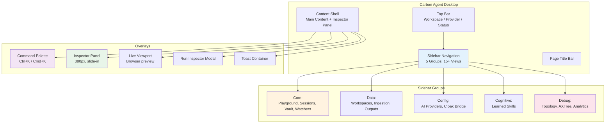

### 6.2 Command Palette (Ctrl+K)

**Features**:
- Search all views and actions
- Keyboard navigation (↑/↓/Enter/Escape)
- Grouped by category (Navigation, Actions)
- Visual shortcut hints

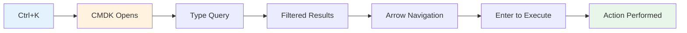

### 6.3 View List (15+ Screens)

| # | View | Category | Purpose |
|---|------|----------|---------|
| 1 | **Playground** | Core | Chat interface with AI assistant |
| 2 | **Sessions** | Core | Orchestration session control |
| 3 | **Knowledge Vault** | Core | Markdown note-taking with backlinks |
| 4 | **Watchers** | Core | Scheduled task monitoring |
| 5 | **Workspaces** | Data | Workspace management |
| 6 | **Ingestion** | Data | Document pipeline status |
| 7 | **Outputs** | Data | Generated document viewer |
| 8 | **AI Providers** | Config | LLM provider settings |
| 9 | **Cloak Bridge** | Config | Browser profile management |
| 10 | **Learned Skills** | Cognitive | Reusable agent skill library |
| 11 | **Topology** | Debug | Agent graph visualization |
| 12 | **AXTree** | Debug | Accessibility tree inspector |
| 13 | **Analytics** | Debug | Watcher run statistics |

---

## 7. Data Models & Schemas

### 7.1 Core Entity Relationship

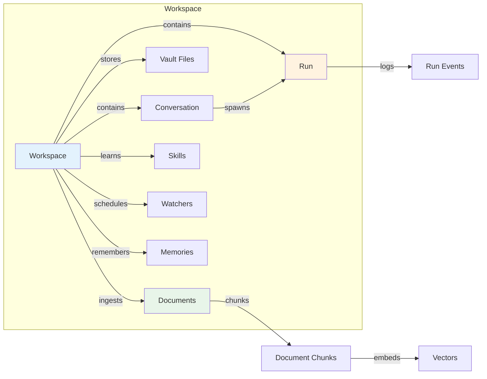

### 7.2 Orchestration Data Model

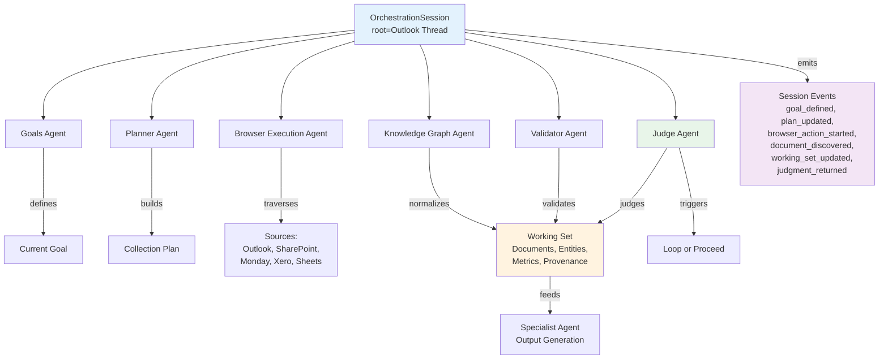

### 7.3 Run Event Types

| Event Type | Description | Example |
|------------|-------------|---------|
| `llm_request` | LLM API call initiated | Sending user query to Claude |
| `llm_response` | LLM response received | Assistant message received |
| `llm_error` | LLM API failure | Rate limit exceeded |
| `tool_call_start` | Tool execution started | Opening browser for download |
| `tool_call_end` | Tool execution completed | File downloaded successfully |
| `tool_call_error` | Tool execution failed | Network timeout |
| `system_message` | System message | Agent handoff complete |
| `ingestion_start` | Ingestion job started | Processing new document |
| `ingestion_complete` | Ingestion finished | 47 chunks created |
| `user_message` | User sent message | "Summarize this file" |
| `assistant_message` | Assistant response | "Here's the summary..." |

---

## 8. Core Features

### 8.1 Playground (Chat Interface)

**File**: `apps/desktop/src/renderer/views/playground-view.ts`

| Feature | Description |
|---------|-------------|
| Session Context | Workspace + Provider selectors |
| Suggested Tasks | Quick-action chips (Inspect portal, Ingest file, Draft document) |
| Chat Thread | User / assistant message bubbles |
| Streaming | Real-time LLM response streaming |
| Tool Results | Inline tool execution cards |
| Empty State | Helpful onboarding when no conversation |

### 8.2 Knowledge Vault

**File**: `apps/desktop/src/renderer/vault.ts`

| Feature | Description |
|---------|-------------|
| File Tree | Hierarchical markdown file browser |
| Search | Full-text search over vault files |
| Editor | In-place markdown editor |
| Preview | Live rendered markdown preview |
| Outgoing Links | Links from current note |
| Backlinks | Notes linking to current note |
| Mentions | Contextual mentions found in content |
| Inspector | Detail panel for selected file |

### 8.3 Document Generation

**File**: `apps/desktop/src/document-generator.ts`

| Output Format | Library | Use Case |
|---------------|---------|----------|
| Markdown | Native | Quick notes, reports |
| DOCX | docx (npm) | Business documents |
| PDF | pdf-lib (npm) | Formatted reports |

### 8.4 Watchers (Scheduled Tasks)

**File**: `apps/desktop/src/watcher-manager.ts`

| Field | Description |
|-------|-------------|
| Name | Human-readable task name |
| Prompt | Instruction for the agent |
| Cron Expression | Schedule (e.g., "0 9 * * 1" for weekly) |
| Enabled | On/off toggle |
| Profile | Optional browser profile for auth |
| Status | Success / Failed / Running / Pending |
| Last Run | Timestamp of last execution |

### 8.5 CLI Sub-Agents

**File**: `apps/desktop/src/cli-subagent.ts`

**Detected CLIs**:
| CLI | Purpose | Install Command |
|-----|---------|-----------------|
| Claude Code | Anthropic's coding assistant | `npm install -g @anthropic-ai/claude-code` |
| Codex | OpenAI's coding assistant | `npm install -g @anthropic-ai/???` |

---

## 9. Browser Orchestration

### 9.1 Browser Orchestration Goals

Carbon Agent's flagship feature: autonomous multi-source browser collection.

**Sources**:
- Outlook (email threads)
- SharePoint (documents)
- Monday.com (project boards)
- Xero (financial data)
- Web Spreadsheets (Google Sheets, Excel Online)

### 9.2 Two Supervision Modes

| Mode | Description | Use Case |
|------|-------------|----------|
| **Watch Mode** | System runs autonomously, user watches live viewport | Trusted sessions |
| **Confirm Mode** | System pauses at checkpoints for user approval | Sensitive data |

### 9.3 Orchestration Execution Flow

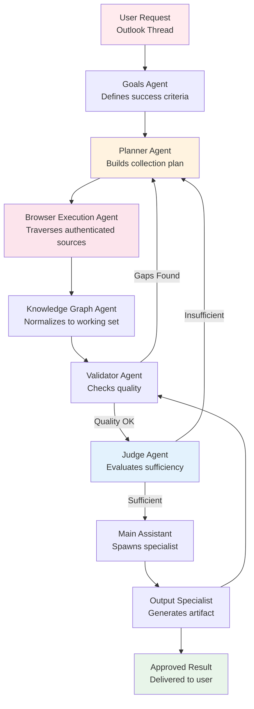

### 9.4 Persistent Core Agents

| Agent | Role | Responsibility |
|-------|------|-------------|
| **Main Assistant** | Coordinator | User conversation, specialist spawning |
| **Goals Agent** | Objective Setter | Explicit success criteria |
| **Planner Agent** | Strategist | Collection plan, source selection |
| **Browser Execution Agent** | Collector | Authenticated browser operations |
| **Knowledge Graph Agent** | Organizer | Working set normalization |
| **Validator Agent** | Quality Gate | Extraction quality checks |
| **Judge Agent** | Arbiter | Sufficiency vs. original request |

### 9.5 Ephemeral Specialist Agents

| Specialist | Deliverable |
|------------|-------------|
| Spreadsheet Analyst | Data analysis report |
| PDF/Document Analyst | Document extraction |
| Financial Statement Generator | Financial reports |
| Dashboard Generator | Interactive dashboards |
| Presentation Generator | Slide decks |
| Forecast Modeler | Projections |
| Claude Code Sub-Agent | Code tasks |
| Codex Sub-Agent | Code tasks |

---

## 10. Developer Guide

### 10.1 Build & Run

```bash
# Install dependencies
pnpm install

# Build all packages
pnpm build

# Type check
pnpm typecheck

# Run tests
pnpm test

# Start Electron dev
pnpm --filter carbon-agent-desktop dev
```

### 10.2 Package Dependencies

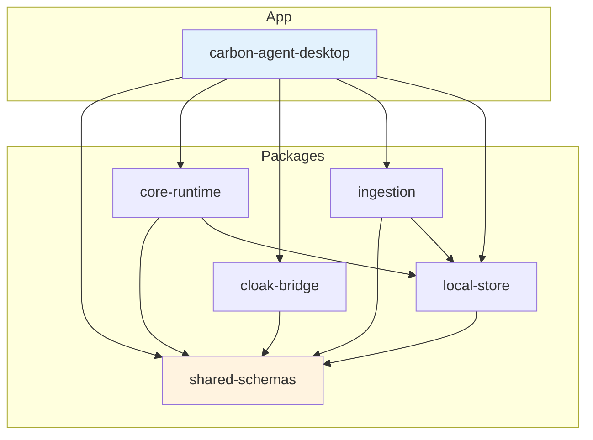

### 10.3 Testing

| Package | Tests | Status |
|---------|-------|--------|
| shared-schemas | 15 | All pass |
| cloak-bridge | 7 | 1 pass (known: pruneAXTree not exported) |
| local-store | 11 | All pass |
| core-runtime | 20 | All pass |
| desktop | 2 | Pass (main, ipc-handlers) |

### 10.4 Code Style

- **TypeScript**: Strict mode, no implicit any
- **IPC**: All requests/responses Zod-validated
- **CSS**: Variables-driven, no inline styles
- **Unicode**: Zero emoji/symbols in source (CSS pseudo-elements only)
- **Security**: `sandbox: true`, `contextIsolation: true`, no `nodeIntegration`

### 10.5 Database Schema Overview

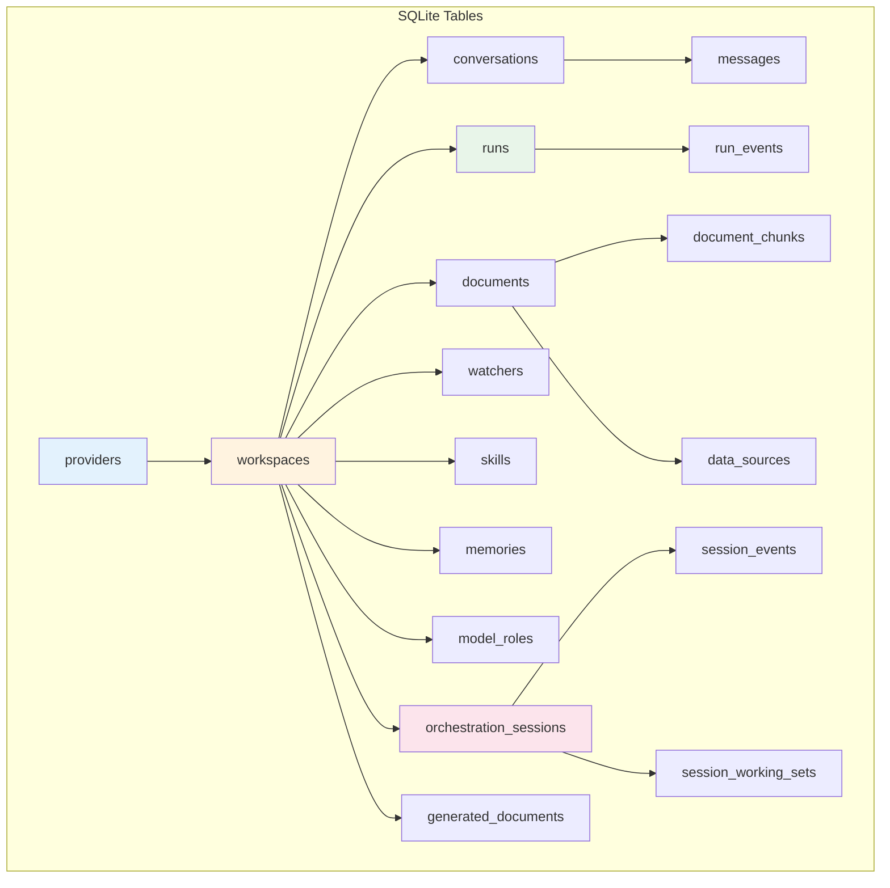

---

## 11. Appendix

### 11.1 File Size Reference

| Component | Lines | Size |
|-----------|-------|------|
| `renderer.ts` | 290 | 12.5 KB |
| `styles.css` | ~1500 | 52 KB |
| `playground-view.ts` | ~400 | 12.3 KB |
| `providers-view.ts` | ~450 | 13.6 KB |
| `session-view.ts` | ~520 | 16.6 KB |
| `profiles-view.ts` | ~330 | 10.5 KB |
| `skills-view.ts` | ~260 | 7.9 KB |
| `ipc-handlers.ts` | 719 | 33 KB |
| `shared-schemas/index.ts` | 709 | 27.8 KB |
| `agent-runner.ts` | ~700 | 25 KB |

### 11.2 JUDGE EVALUATION GATES

All GUI iterations pass 4 quality gates:

| Gate | Criteria | Status |
|------|----------|--------|
| **Gate 1** | Visual Hierarchy & Cohesion | PASS |
| **Gate 2** | Information Density & Clarity | PASS |
| **Gate 3** | Architectural Integrity | PASS |
| **Gate 4** | Provisional Polish | PASS |

### 11.3 Design System Tokens

| Token | Value | Usage |
|-------|-------|-------|
| `--font-xs` | 11px | Metadata, badges |
| `--font-sm` | 12px | Labels, timestamps |
| `--font-base` | 14px | Body text |
| `--font-lg` | 17px | Section titles |
| `--font-xl` | 20px | Page titles |
| `--sidebar-width` | 200px | Navigation width |
| `--topbar-height` | 48px | Header height |
| `--inspector-width` | 380px | Detail panel |

---

*Wiki generated: 2026-06-06*
*Carbon Agent v0.1.0*
*All Rights Reserved*
